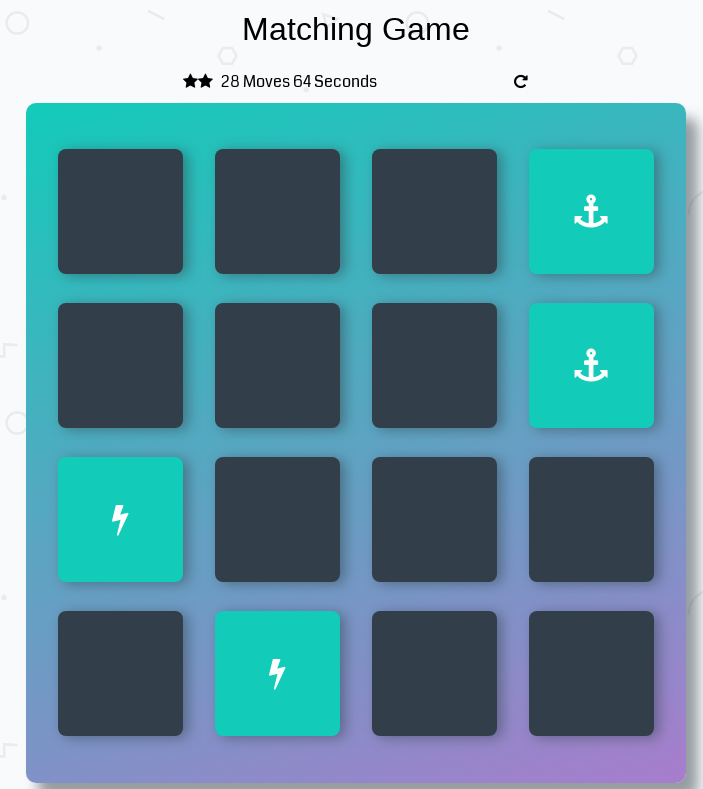
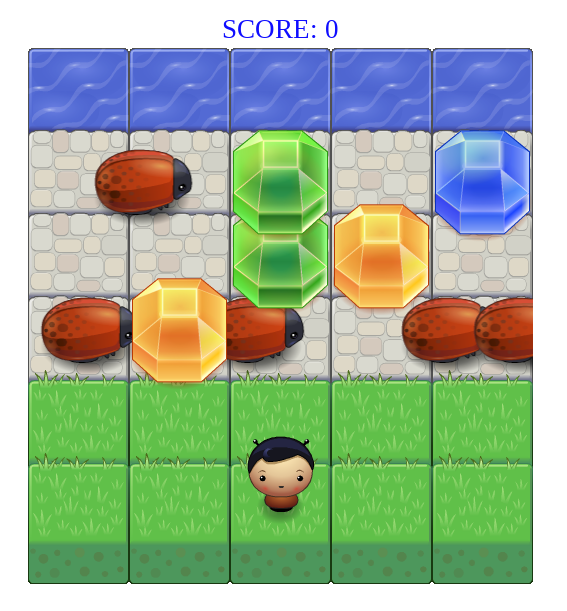
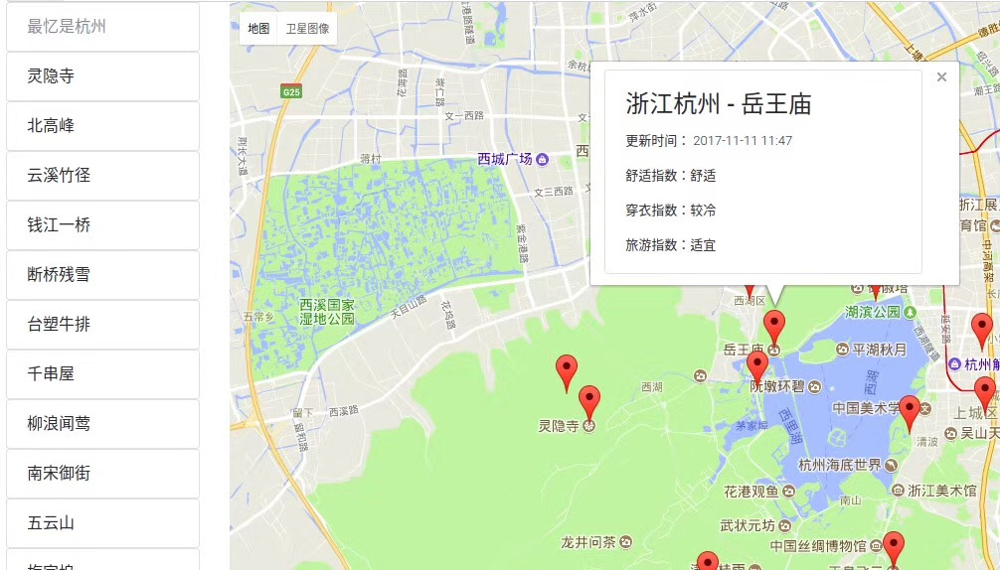
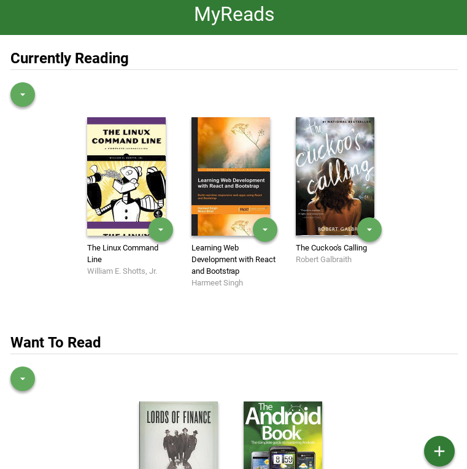
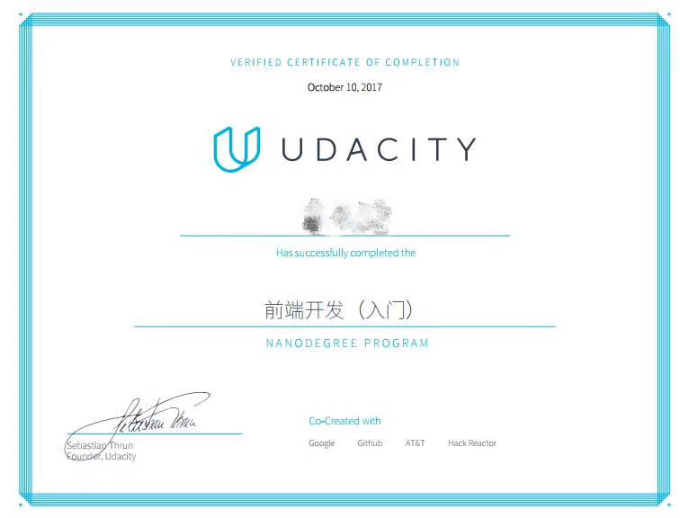
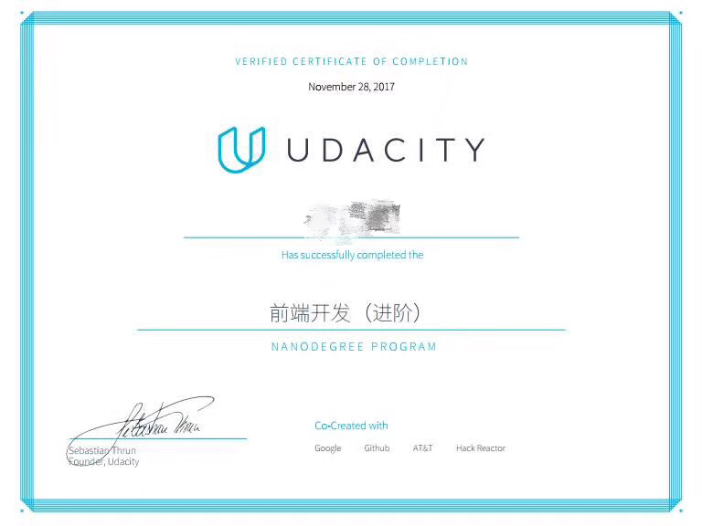

# Udacity Front-End Web Developer Nanodegree (FEND)

[Udacity前端工程师纳米学位](http://cn.udacity.com/fend)

## 完成的前端开发入门项目

### 1. [培养开发者思维](https://github.com/leesper/become-frontend-developer/tree/master/P0_WebDeveloperMindset)
* 解决问题的心态：要坚持成长式思维，避免僵固式思维；
* 解决问题的策略：
1. 将大问题不断分解为小问题，直到容易上手，通过完成一个一个的小问题最终解决大问题；
2. 学会查阅资料，向别人提问和求助；

### 2. [博客文章](https://github.com/leesper/become-frontend-developer/tree/master/P1_MockupToArticle)
根据设计原型，将页面原型翻译成HTML网页。

### 3. [动物交换卡](https://github.com/leesper/become-frontend-developer/tree/master/P2_AnimalTradingCards)
根据设计原型重头创建一个HTML网页，并使用CSS修饰达到想要的效果。

### 4. [作品集网页](https://github.com/leesper/become-frontend-developer/tree/master/P3_PortfolioSite)
此项目要求根据提供的PDF设计原型构建一个作品集网站，要求该网站必须符合响应式设计的要求，在任何设备上都能正确显示。本人负责整个作品集网站的开发工作。我首先使用Bootstrap框架构建了作品集网站，通过框架的帮助实现了响应式设计；然后我又再次构建了一个一模一样的网页，但这次我使用了flex-box布局工具来实现响应式设计，我首先通过CSS将img设置为max-width: 100%，并使用百分比来调整各元素的大小，最后我使用Devtool自带的模拟器测试了页面在手机，平板等移动设备上的显示，并通过media-query进行微调。该项目锻炼了我设计响应式页面的熟练度。

### 5. [电子简历](https://github.com/leesper/become-frontend-developer/tree/master/P4_OnlineResume)
此项目要求根据提供的HTML和CSS模板，通过编写JavaScript脚本来构建动态在线简历。本人负责整个在线简历的实现工作。我首先通过提供的HTML模板熟悉了页面的大致结构，然后根据项目要求开发了4个JS对象，分别代表“个人信息”，“教育经历”，“工作经历”和“项目经历”。然后编写4个对象各自的display成员函数，将各自信息动态显示到网页中，为了完成该任务，我对项目提供的字符串模板进行了替换，然后使用jQuery将包含HTML元素的字符串添加到页面中，并对CSS进行动态修改以达到我想要的效果。最后我还通过谷歌地图服务在简历页面中显示了自己学习和工作过的城市，并按照自己的想法修改了CSS，主要是调整页面颜色。该项目使我熟悉了前端开发常见的模式，学会开发自己的交互式简历。

## 完成的前端开发进阶项目
### 5. [记忆游戏](https://github.com/leesper/become-frontend-developer/tree/master/P5_MemoryGame)

“记忆游戏”是使用前端技术实现的网页小游戏，通过点击卡片配对相同的图案顺利通关，并记录游戏时间和玩家走了多少步。本人负责在项目提供的静态HTML和CSS资源基础上进行二次开发，通过Javascript实现游戏逻辑并提供基本的动画效果。为了实现该项目，我首先快速浏览了项目代码的大致结构，特别是提供的CSS效果和对应的class类型，然后决定使用jQuery来实现功能。根据项目需求，我开发了Game类，先实现了displayCards()函数，将卡片随机洗牌然后显示到4*4的游戏面板中。开发setupClickListener()函数，编写用户点击卡片和相关按钮的动作逻辑，以及游戏胜利的判断条件。开发了一系列相关函数，包括游戏计时，用户评分和重置按钮等等。最后修改HTML文件，编写了游戏通关界面，该界面一开始是隐藏的，当用户通关时才会显示，这些工作完成后，开始对游戏效果进行微调，通过jQuery的animate函数和CSS提供了基本的动画效果，比如点击错误时卡片抖动并变红，点击正确时卡片颜色变成浅蓝色等等。整个Javascript代码是按照面向对象的风格设计的，易于维护和修改。该项目的完成提高了我对面向对象的Javascript编程的驾驭能力。

### 6. [青蛙过河](https://github.com/leesper/become-frontend-developer/tree/master/P6_ArcadeGame)

“青蛙过河”是前端技术实现的网页小游戏，玩家控制游戏主角前后左右移动，走过河即顺利通关，捡到钻石等宝物能获得加分，但前进的路上碰到虫子即通关失败，分数清零。本人负责在项目提供的基础代码基础上进行二次开发，实现核心功能。为了实现该项目，我首先快速浏览了代码的大致结构，特别是游戏引擎和资源有哪些功能是现成的。在这个基础上，我开发了Enemy，Player和Diamond类。Enemy代表游戏中的虫子，它的主要逻辑是随机分布到用户要经过的道路中，从屏幕左侧到右侧不断地循环移动，且每个虫子的移动速度不一样，我在Enemy类上实现了关键的碰撞检测算法，判断如果游戏主角和虫子发生碰撞就重置分数并让玩家重新开始；Player代表玩家操作的游戏主角，它需要实现的核心功能是处理用户输入，根据玩家按下的方向键移动；Diamond代表钻石，它也需要实现碰撞检测算法，目的是为了给玩家加分奖励。最后我创建了allEnemies和allDiamonds数组，以及全局唯一的player对象，添加键盘的事件监听机制，启动游戏。通过该项目我丰富了自己的Javascript编程经验。

### 7. [订阅阅读器测试](https://github.com/leesper/become-frontend-developer/tree/master/P7_FeedReader)

“阅读器测试”是对已经开发完毕的项目编写单元测试，目的在于熟悉Jasmine这个“行为驱动开发”的测试框架。本人负责根据详细说明开发测试用例，对阅读器进行单元测试。为了完成该项目，我首先对项目提供的HTML，CSS和Javascript进行快速熟悉，之后查看Jasmine的文档，查看使用示例。然后开始编写测试用例，确保关键的数据不为空，确保菜单默认为空，并在点击时变为可见等等，最后对执行异步请求的功能进行测试，确保请求后内容发生变化。通过该项目，我熟悉了Jasmine框架的使用，特别是如何测试异步请求，这对我今后实施测试驱动的前端开发奠定了基础。

### 8. [街区地图](https://github.com/leesper/become-frontend-developer/tree/master/P8_NeighborhoodMap)

“街区地图”是基于地理信息API构建的单页应用，该应用能标记事先设定的地理位置，并响应用户的输入，当用户点击列表或者地图上的标记时，会显示相关信息，比如天气指数等等。本人负责整个项目的编写，包括静态页面的构建和动态功能的实现。首先，我将整个项目分解为三个子任务：构建UI，处理用户交互和接入第三方API。我通过“盒子模型”先对页面进行建模，划分出几个主要的部分，使用Bootstrap框架先把页面做出来，并通过改变浏览器窗口大小测试其响应式布局是否正常；然后我阅读KnockoutJS技术文档，掌握框架的基本使用方法，并通过它建立项目的MVVM结构，实现数据和UI双向绑定，当用户在搜索栏输入位置时，左边的位置列表会动态地更新，且当用户鼠标移动到某个位置上时，地图上相应的标记会上下跳动以提示用户；最后，我接入了第三方API，我选择了“Google Map”API和“和风天气”API，使用地理编码API通过位置信息查到经纬度坐标，然后使用marker在地图上标记位置，当用户单击列表或者marker时，通过infoWindow显示该地点的名称，和各种基本的天气指数（舒适指数，穿衣指数和旅游指数等）。整个项目的实现过程中我使用了很多ES6的新特性和新语法，通过该项目的锻炼，我提高了自己对整个前端技术的驾驭能力，增强了自己重头构建整个项目的能力，并熟悉了如何通过Javascript异步请求API并解析数据。

### 9. [图书跟踪应用](https://github.com/leesper/become-frontend-developer/tree/master/P9_MyReads)

“图书跟踪应用”是基于ReactJS+React-Router开发的Web应用，用户可以通过该应用管理自己“已读”，“正在读”和“想读”的书籍，并可以搜索添加新书。本人负责整个项目的编写。我首先快速学习了React相关的知识，查阅文档，特别是“Thinking in React”。然后将应用分为两个页面：图书列表页面和书籍搜索页面，利用盒子模型细分页面然后将各基础元素组件化，分别开发各个组件，然后再组合起来形成完整页面。在此基础上对应用需要管理的状态进行建模，抽象出业务模型并独立出来形成一个模块。这些工作都做完后，开始正式添加交互功能，通过componentDidMount()生命周期函数请求服务端数据并更新状态重新渲染页面，为用户选择下拉列表项增加回调函数，处理书籍类别的变化，添加以及删除操作。在完成全部需求的基础上，我还扩展了应用功能，增加了批量移动书籍的功能，最后调试测试，修复bug并提交。通过该项目，我锻炼了自己使用ReactJS进行Web开发的能力。

## 前端开发工程师纳米学位证书

