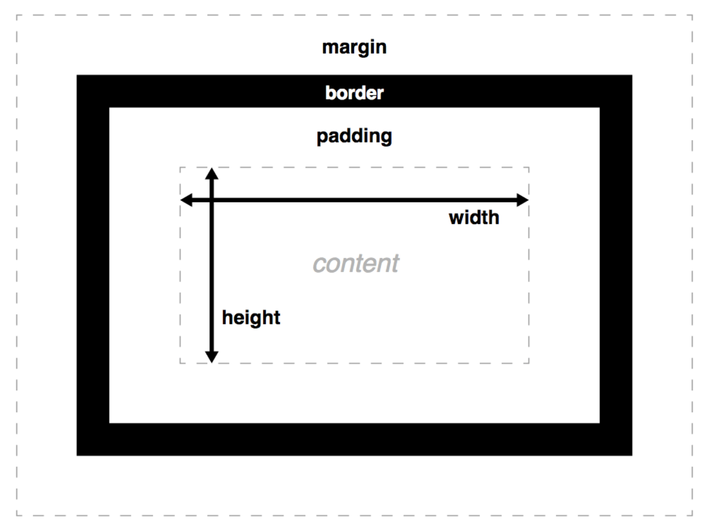

# 前端页面设计的基础思维：盒子模型

在前端工程师的眼里，可以说“万物皆盒子”。盒子模型是前端工程师将HTML和CSS结合起来，按照设计稿进行前端页面设计的一个“契合点”。“万变不离其宗”，前端页面布局的方法层出不穷，但不管它再怎么变化，一定是基于盒子模型的。掌握盒子模型的基础思维方式，有助于我们后面深入地学习响应式布局。下面我们就来系统的学习一下盒子模型。

## 一.显示属性

HTML元素有两种类型：块元素（block）和内联元素（inline）。这两种元素的区别主要是：块元素尽可能占据最大宽度而高度够用就好，可以通过`display:block`将元素设置为按块级元素显示；内联元素和内容一样宽，无法设置高度和宽度，但是可设置内外边距进行水平扩展，可以通过`display:inline`将元素设置为按内联元素显示。还有一种`display:inline-block`可以将元素设置为“行内块元素”，这样既可以像block元素一样设置宽高，又可以像inline元素一样行内显示。

## 二.盒子模型4要素

盒子模型将每一个元素组织成文档布局内的一个矩形框，从内（inside）向外（outside）分为4个组成部分，如下图所示：



content表示元素显示的内容，它被内部填充padding包裹起来，然后是元素的边界border，这三个要素共同组成盒子模型的inside部分，表示元素的内部，而外边距margin则表示元素和其他元素之间的距离，属于盒子模型的outside部分。如果我们把一个元素看作是一个人体的化，其实对于盒子模型我们可以这么理解：content表示人的骨架，它由血肉（padding）填充，border好比人的皮肤，人和人之间的距离就是外边距margin。通过这样形象的比喻，就能理解盒子模型的4个要素了。

## 三.决定元素大小的属性

box-sizing是决定元素大小计算方式的属性，它有两个值：border-box和content-box。如果选择了border-box，那么元素尺寸的值为content+padding+border三个部分，即元素实际尺寸已包含padding和border尺寸。content-box是默认设置，元素尺寸仅包含content，元素实际尺寸还要加上padding和border的尺寸。关于盒子模型可以参考一些比较好的[资料](https://developer.mozilla.org/zh-CN/docs/Web/CSS/CSS_Box_Model/Introduction_to_the_CSS_box_model)

## 四.容器机制

HTML是标记语言，这种语言就像不断嵌套的容器一样一层套一层，它最终形成的是一个树形结构，称为**文档对象模型（DOM）**。子元素的大小会受到父元素的影响，如果我们用百分比设置相对于父元素的大小，那么只根据最近的父元素属性值计算子元素的大小。也就是说我们不光可以用固定的像素值设置大小，也可以用百分比设置大小，这个百分比是相对于最近的父元素而言的。
	
## 五.使用语义元素

编写HTML要注意多使用语义元素，这样做的好处是避免div soup，即满篇的div元素看的人眼花缭乱，很难读懂。多使用语义元素对搜索引擎也很友好。语义元素有几个基本分类，首先是**内容分区**，适用于在页面上安排布局；文本内容适用于文本，此外还有内联文本语义，比如`<em>`，`<code>`和`<time>`等元素。有关HTML元素，请参考[官方文档](https://developer.mozilla.org/zh-CN/docs/Web/HTML/Element)。
	
## 六.从视觉设计稿到网页

掌握了盒子模型的基本原理，我们就可以以盒子模型的基础思维来对网页进行设计。如果把网站看作房子，那么HTML就是墙体结构，CSS则是装修风格，而JS呢，则是交互式开关。最终，HTML会被浏览器翻译为页面结构，形成DOM，而样式由CSS决定。从视觉稿到网页的设计过程首先是将设计稿分解为盒子：从最大方框开始，从大到小分割，任何设计都转化为盒子。然后编写基本框架结构，先使用div，替换为语义标记并定义有意义的class，最后构建HTML DOCTYPE形成基本的网页架构。

有了基本的网页架构，第二步就是综合使用HTML和CSS做视觉设计。首先要采用一定的布局技巧对盒子进行布局，比如使用弹性框布局，或者使用Bootstrap这样的响应式框架。不断的添加CSS修改和调整样式，进行修改和调整。CSS之所以被称为“层叠样式表”，这里的“层叠”是指匹配规则有一定的顺序，即“最具体的规则生效”，首先是浏览器的默认样式，不同浏览器样式稍有不同；其次是单独文件中样式表，这是大多数时候使用的，下方的规则会覆盖上方的；然后是HTML中直接添加样式表，在小型实战项目中可以这么做，但是不理想；最后是元素的内联样式，虽然也可以这么做，但应该避免，是一种不好的实践。

有一种比较好的调试技巧是在网页设计时把边框显示出来，可以利用下面的代码显示边框：

```
{
    border: 1px solid red !important
}
```
