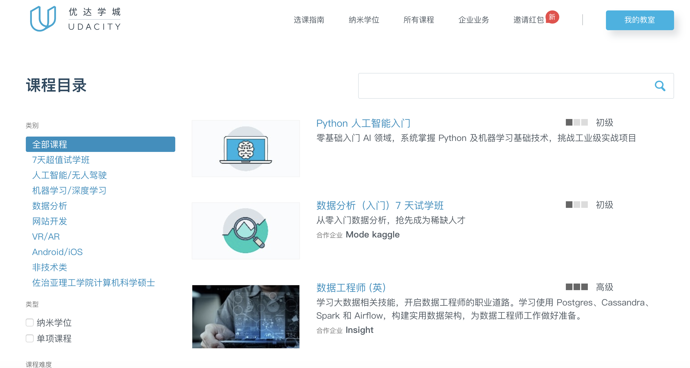
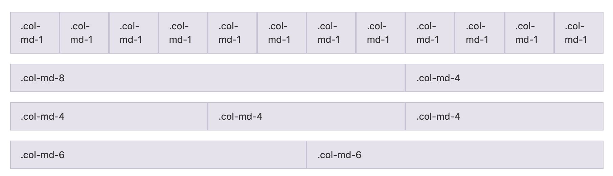
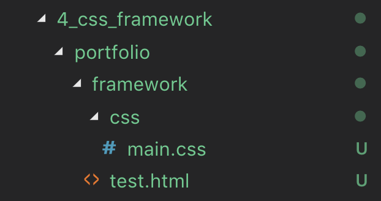
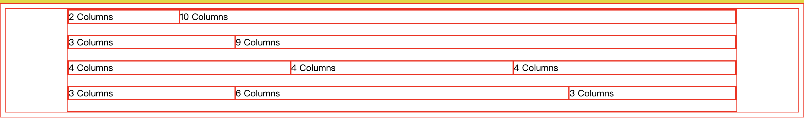
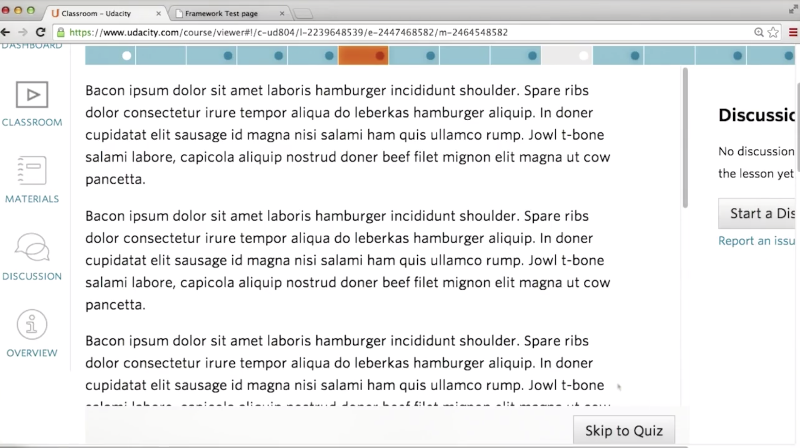
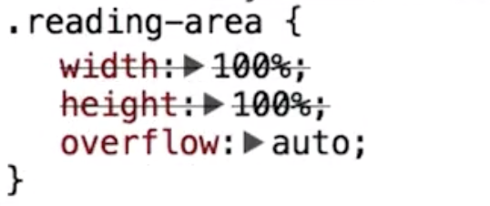
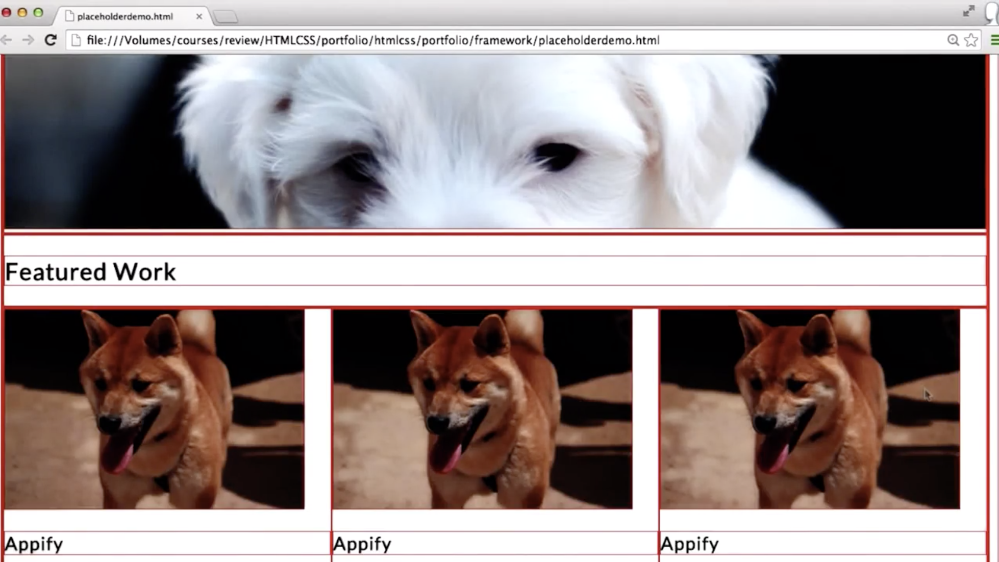

# 响应式布局框架原理

网页的响应式设计是一种设计实践，这种设计实践是随着移动互联网时代的到来而逐渐兴起的。随着智能设备的兴起，人们不再仅仅是通过个人电脑来访问网页，还有可能使用智能手机或者平板电脑，如何适配各种不同尺寸大小，不同分辨率的设备，为网页设计带来了新的挑战。而响应式设计就是一种解决方案，采用响应式设计后，同样的一个网页会在不同设备上显示不同的布局，从而带来良好的用户体验。本文将通过设计一个简单到不能再简单的响应式框架来展现响应式设计的基本原理。

## 一. 什么是响应式设计

就像我们可以用盒子模型的思维来看待网页一样，我们同样可以使用“格子”的思维来看待网页的结构。我们的眼睛在看东西时会遵循一定的模式，比如先从左往右看，然后从上往下看。比如先看文字，然后看标题，最后再阅读下面的文字等等。我们将这样的设计称为网格布局，很多网站都遵循网格布局，不难看出Udacity的网站就是网格布局的：



编写一个响应式框架的原理就是通过创建一些通用的CSS类来定义所需要的样式，特别是控制元素宽度的技巧以及在页面上排布的方式。创建用于控制布局的CSS类是一种最佳实践。

## 二. 一个非常简单的响应式框架

要实现响应式设计，让网站根据浏览器的大小来改变元素的大小，肯定不能用绝对尺寸，比如300px，必须使用百分比代表的相对尺寸。在上一个学习笔记中我们提到，如果将元素的尺寸设置为百分比，那么该元素的大小由离它最近的父元素大小决定。响应式框架的基本原理就是将一行（row）拆分为12个网格（grid），这样我们就可以基于网格进行各种形态的布局设计，比如大名鼎鼎的Bootstrap框架是这么定义的：



我们以一个示例项目来讲解如何编写一个简单的响应式框架，项目的目录结构如下：



在main.css文件中编写框架如下（注意这里的row使用了flex显示类型）：

```css
* {
    border: 1px solid red !important;
}

* {
    -webkit-box-sizing: border-box;
    -moz-box-sizing: border-box;
    -ms-box-sizing: border-box;
    box-sizing: border-box;
}

.grid {
    margin: 0 auto;
    max-width: 1200px;
    width: 100%;
}

.row {
    width: 100%;
    margin-bottom: 20px;
    display: flex;
}

.col-1 {
    width: 8.33%;
}

.col-2 {
    width: 16.66%;
}

.col-3 {
    width: 25%;
}

.col-4 {
    width: 33.33%;
}

.col-5 {
    width: 41.66%;
}

.col-6 {
    width: 50%;
}

.col-7 {
    width: 58.33%;
}

.col-8 {
    width: 66.66%;
}

.col-9 {
    width: 75%;
}

.col-10 {
    width: 83.33%;
}

.col-11 {
    width: 91.66%;
}

.col-12 {
    width: 100%;
}
```

在test.html中编写测试代码：

```html
<!DOCTYPE html>
<html>
<head>
  <meta charset="utf-8">
  <title>Framework Test Page</title>
  <link rel="stylesheet" href="css/main.css">
</head>
<body>
  <div class="grid">
    <div class="row">
      <div class="col-2">2 Columns</div>
      <div class="col-10">10 Columns</div>
    </div>
    <div class="row">
      <div class="col-3">3 Columns</div>
      <div class="col-9">9 Columns</div>
    </div>
    <div class="row">
      <div class="col-4">4 Columns</div>
      <div class="col-4">4 Columns</div>
      <div class="col-4">4 Columns</div>
    </div>
    <div class="row">
      <div class="col-3">3 Columns</div>
      <div class="col-6">6 Columns</div>
      <div class="col-3">3 Columns</div>
    </div>
  </div>
</body>
</html>
```

观察页面显示效果：



## 三. 一些小技巧

### 1. 负空间

设计中有个概念叫“负空间”，即不包含任何内容的空间。如果你发现相邻的文字之间靠的太近，可以使用padding为元素增加内边距。内边距是元素之间创建负空间的绝佳手段。如果想在元素外边创建负空间，还可以使用外边距margin。

### 2. 溢出

如果页面上出现了大段的文字，很长，我们可以给这段文字加上滚动条。如果想在有限空间内放入大段文字，我们可以使用`overflow: auto`。





## 四. 媒体查询

可以使用媒体查询（media queries），使得CSS随着页面的变化而发生改变。这样无论用户是使用手机还是台式机，都可以根据用户所用设备类型来改变页面的CSS。例如以下媒体查询将在屏幕小于300px时将段落中的文字背景颜色改为蓝色。

```css
@media only screen and (max-width: 300px) {
    p {
        background-color: blue;
    }
}
```

## 五. 适配各型浏览器

可以使用normalize.css来解决跨浏览器的兼容性。

## 六. 使用自研框架开发一个个人介绍页

举个例子，如果我们要使用这个简单的响应式框架来设计下面这样的个人介绍页，我们该怎么设计呢？


同样地，我们先使用盒子模型对设计稿进行设计，然后将页面分解为网格，比如上图中顶部的红框，其实就是一个row类型的元素，其中包含姓名的部分可以设计为col-6，同样地，底部的红框部分也是row类型，而蓝框部分很明显是col-4。

一旦建立了HTML的结构，就可以考虑添加其他东西了，比如语义标签。对于页面上比较重要的信息，可以使用h1，h2和h3这样的元素来显示，同时也可以用语义元素划分页面的区域，比如header，footer等等。

页面整体布局大致成型后就可以对页面进行调整了，比如一开始没有图片，我们就可以使用一些可以自定义图片尺寸的占位图片服务，起到在关键位置提示图片尺寸的作用。比如[placehold.it](https://placeholder.com/)，比如在HTML中编写img元素时如果使用`https://via.placeholder.com/960*350`就可以显示960*350大小的图片。还可以使用[placekitten](https://placekitten.com/)放一些猫猫的图片，更有趣一些。

从整体到局部，布局工作完成后，就可以开始处理细节了，比如背景颜色，外边距，边框和字体等等。对于字体，可以使用[Google Fonts](https://fonts.google.com/)，[这里](http://www.googlefonts.cn/)是中文版。



如上图所示，细节还需要不断进行微调和完善，以越来越接近设计稿，可以采用“编码-测试-优化”的循环来进行，编写代码，然后在浏览器中打开页面测试代码，然后对代码做优化调整。不断的进行这个循环。先将布局做的尽可能接近设计稿，对布局满意后再进行定制。

以上就是响应式布局的基本原理。对于实际开发来说，这样的框架还是太简单了，我们可能会需要使用更复杂的样式和特性。相比于自己编写这样的复杂框架，我们更倾向于使用别的成熟框架。下次我们将介绍大名鼎鼎的Bootstrap框架。