# CSS布局与响应式设计


在移动设备出现之前，人们访问网站需要通过PC端的浏览器来实现。Web前端工程师主要解决的是页面在各型浏览器之间适配的问题。后来，随着平板电脑和智能手机的普及，移动端的访问量呈爆炸式增长，前端工程师面临的问题变成了如何在不同大小的设备上呈现同样的网页。能不能"一次设计，到处适用"，让同一张网页自动适应不同大小屏幕，自动调整布局？让网页在较小的屏幕上也能有较好的用户体验，于是**响应式设计**就应运而生了。在开始后面的技术细节讨论之前，我们一定要抓住一个中心思想：响应式设计的**核心思想**是让你的网站内容在任何设备上都以最佳的方式呈现。

# 一. 准备工作

我们不可能买下市面上所有型号的移动设备来做设计，而是要使用手边的各种服务，比如[在线浏览器适配服务](<https://www.browserstack.com/>)。如果你使用的是Chrome浏览器，那么就可以使用开发者工具中的模拟器来进行移动设备模拟。在Chrome的开发者工具中那个手机图标就是模拟器，单击它就可以打开，并且我们可以通过下拉菜单来选择具体的设备。


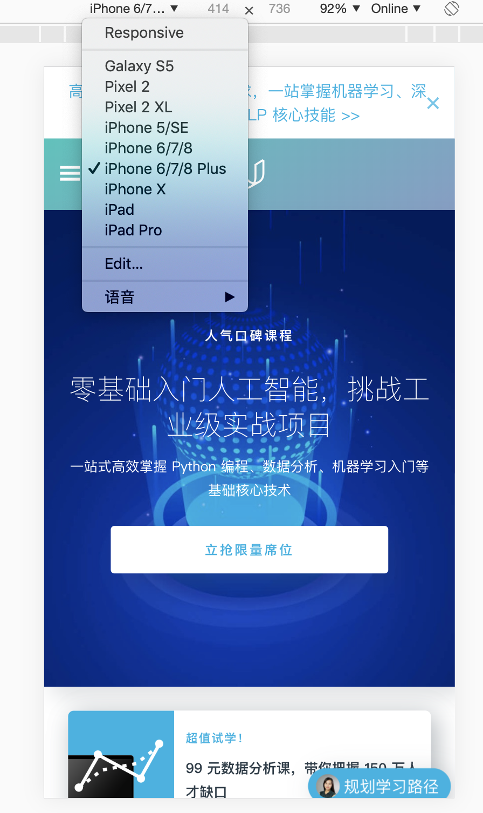


模拟器能自动设置好尺寸和用户代理信息，设备的像素比例并能模拟触控。如果手里面有可供开发调试的手机，我们也可以设置移动设备的远程调试功能。比如如果要适配安卓设备，那么我们就可以准备一台安卓机，USB连接线和开发设备（笔记本电脑）。安卓设备需要设置成开发者模式，然后打开USB调试模式。

接着，在开发设备上打开[inspect](chrome://inspect)页面，然后在安卓设备上用Chrome浏览器打开要调试的页面，用USB连接两个设备，在弹出的对话框中选择确认允许USB调试。在开发设备上就能看到已连接的设备了，我们可以在开发设备上对安卓设备进行各种操作，也可以看到移动设备上打开的页面，相当于把移动设备的屏幕投射到开发使用的笔记本电脑上。在笔记本电脑上进行的操作可以同步在两台设备上显示。


# 二. 像素与视口

在移动设备上访问网页时，我们常常会遇到一种很不愉快的用户体验：整个网页被缩放以适应较小的设备屏幕，一切都变小了，字变小了，图片变小了，最要命的是连按钮都变小了，虽然看上去页面和PC端一样，但什么都看不清点不了，这是因为没有遵循响应式页面设计：窄屏幕设备（比如移动设备）在一个虚拟视口中渲染页面，这个虚拟视口通常比屏幕要宽，例如，如果移动设备的屏幕宽度为640`px`，那么如果以980`px`的虚拟视口来渲染网页，就需要缩小页面来适应640`px`的窗口大小，这就是页面看起来小的原因。要想理解响应式设计，我们先要来重新认识一下像素与视口的概念。

## 2.1 像素

> A pixel is not a pixel

首先我们要来厘清"像素"的概念。在不同的上下文中所指的"像素"可能具有不同的含义。对于浏览器而言使用的像素是CSS样式代码中使用的逻辑像素，叫"CSS像素"，属于Web编程中的概念。1个CSS像素在不同的设备上对应的物理像素可能不同，这是由设备像素比（Device Pixel Ratio）决定的。设备像素则指的是设备的物理像素，单位是`px`。所以当我们说某某移动设备的分辨率为1920*1080像素时，这里的像素实际上指的就是物理像素。

## 2.2 视口（viewport）

浏览器的视口（viewport）是可以看到Web内容的窗口区域。通常与渲染出的页面大小是不同的，除非你通过某种方式告诉浏览器你的网页将会在更小的屏幕上显示，否则浏览器不会知道。所以如果我们要在不同的设备上获得一致的视觉体验，我们就需要：

1. 设置设备像素比DPR
2. 设置视口viewport

设置设备像素比和视口的方法就是在html中为head元素增加viewport标签：

```html
<meta name="viewport" content="width=device-width, initial-scale=1">
```

上面这行代码允许网页宽度自动调整：网页的默认宽度为屏幕宽度，原始缩放比例为1:1，即网页初始大小占屏幕面积100%。与此对应的，也有`height`和`device-height`属性，可以对视口高度进行调整，但不常用。只要把缩放比例控制到1:1，此后我们在页面布局时就只需要关心CSS像素即可。

# 三. CSS布局初探

在CSS中控制布局最重要的属性是`display`属性。各种各样的新式布局都从设置它开始，比如我们后面要讲到的弹性（flex）布局和网格（grid）布局。这里先不讨论这些 高大上的布局，我们先来打好基础。所有的元素都有一个默认的display值：block和inline。block表示该元素为块级元素，这类元素会重新开始一行并尽量撑满容器（即其父元素）；inline表示该元素为行内元素，它不打乱段落的布局，可以用来在段落中包裹一些内容。display属性有一些比较tricky的小技巧，比如如果设置为none则可以在不删除元素的情况下隐藏元素，这种隐藏是不占据显示空间的，即如果你不查看网页源代码你完全感觉不到这个元素的存在。

即然可以避免元素从左到右撑满容器，那么通过设定max-width为固定值并设置左右外边距，我们就能将元素居中显示，剩余的部分将被平均分为两块分列元素的两边：

```css
.box {
  max-width: 600px;
  margin: 0 auto;
}
```

CSS的基础模型是盒子模型，当我们设置元素尺寸时内边距和边框的大小会对元素的尺寸造成影响，这是因为默认的box-sizing属性是content-box，为了避免做各种心算，我们可以设置border-box使内边距和边框不增加宽度：

```css
* {
  -webkit-box-sizing: border-box;
     -moz-box-sizing: border-box;
          box-sizing: border-box;
}
```

## 3.1 position定位

position属性可以用来实现各种复杂的布局，主要有三种：相对，固定和绝对。如果不设置这个属性，那么它的默认值就是static。**如果我们使用其他任何值设置了元素的这个属性，我们就称这个元素为positioned**，记住这句话很重要，因为绝对定位会用到这个概念。

### 3.1.1 相对定位

通过设置position为relative来实现相对定位。这个元素的top，right，bottom和left属性会使得元素偏离正常位置，其他元素的位置不会受其影响来弥补它偏移后留出的空隙：

```css
.relative1 {
  position: relative;
}
.relative2 {
  position: relative;
  top: -20px;
  left: 20px;
  background-color: white;
  width: 500px;
}
```

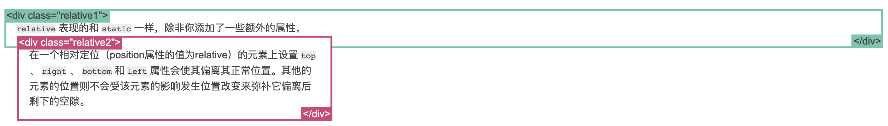

### 3.1.2 固定定位

通过设置position为fixed来实现固定定位。固定定位是相对于视口定位的，无论你怎么拖动滚动条，它永远都显示在相对于视口的一个位置上（脱离文档流）。

```css
.fixed {
  position: fixed;
  bottom: 0;
  right: 0;
  width: 200px;
  background-color: white;
}
```

### 3.1.3 绝对定位

通过设置position为absolute来实现绝对定位。如果绝对定位元素的祖先元素是positioned的，它就相对于该祖先元素绝对定位，否则将相对于body元素绝对定位并随页面滚动而移动。

```css
.relative {
  position: relative;
  width: 600px;
  height: 400px;
}
.absolute {
  position: absolute;
  top: 120px;
  right: 0;
  width: 300px;
  height: 200px;
}
```

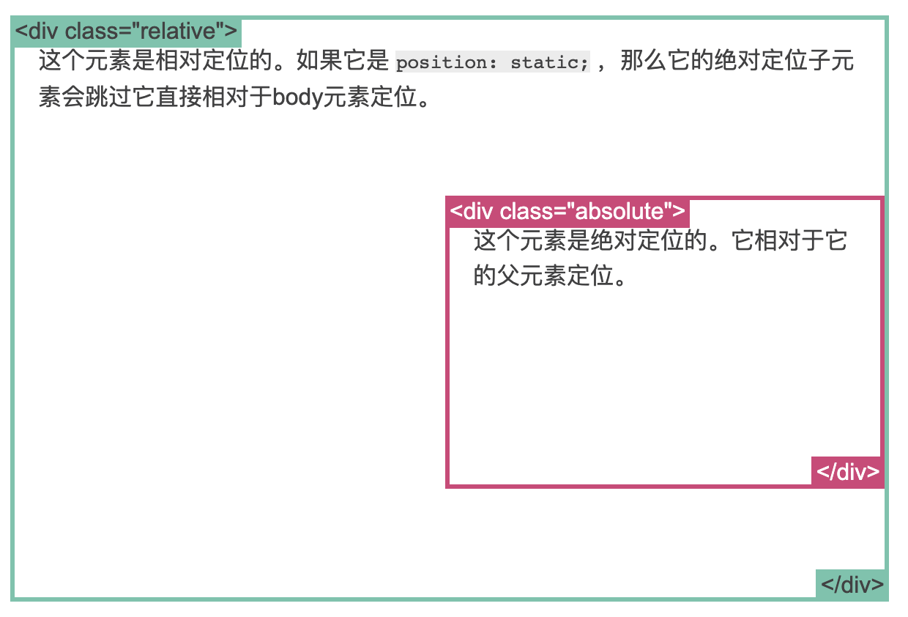

## 3.2 浮动属性

在没有出现flex和grid布局前的黑暗年代里，float属性主要用来实现布局，而现在它主要用来实现文字环绕图片：

```css
img {
  float: right;
  margin: 0 0 1em 1em;
}
```

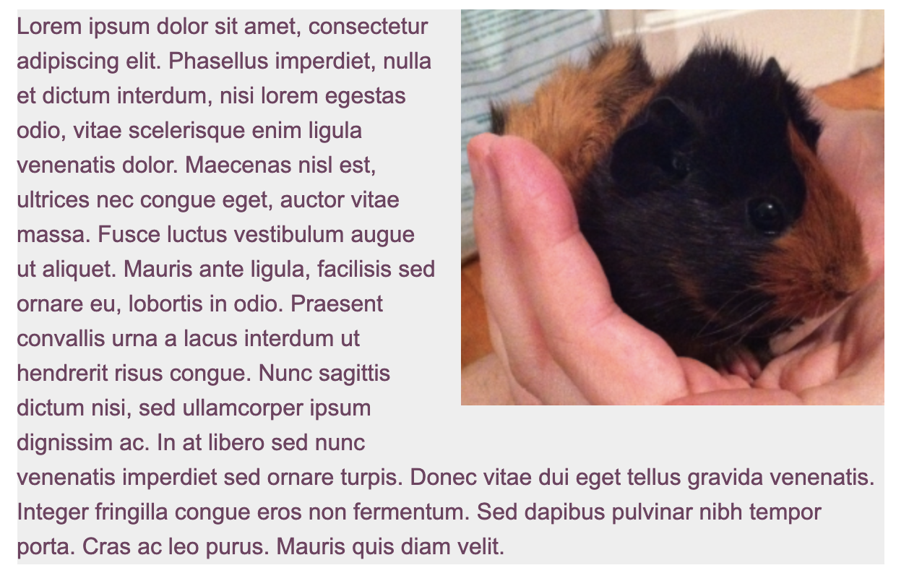

但是在使用float属性时经常需要解决一些稀奇古怪的问题，比如需要将其他元素移动到浮动元素下面避免覆盖，或者避免浮动元素溢出到容器的外面。clear属性可以用来移动到浮动元素的下面：

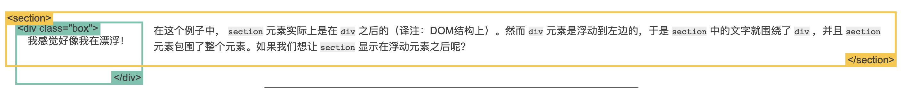

```css
.box {
  float: left;
  width: 200px;
  height: 100px;
  margin: 1em;
}
.after-box {
  clear: left;
}
```

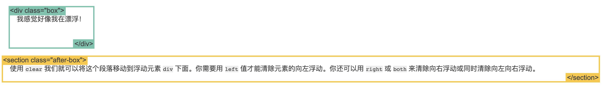

而overflow属性可以避免浮动元素溢出到容器的外面。比如下面这种情况，这个图片比包含它的元素要高， 因为它是浮动的，所以它就溢出到了容器外面：

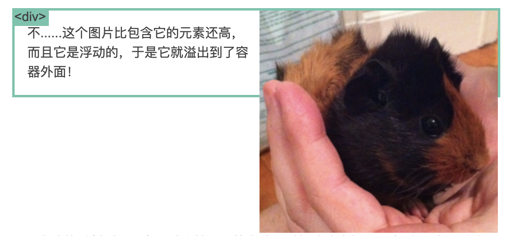

加入下面的CSS样式就好多了：

```css
.clearfix {
  overflow: auto;
}
```

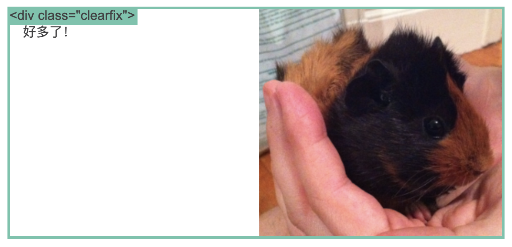

## 3.3 百分比宽度和相对大小

相对宽度是一种相对于父容器的计量单位。响应式设计需要采用相对宽度，不能使用绝对宽度，因为网页会根据页面宽度调整布局，所以编写CSS的时候我们指定`width`要使用百分比：

```css
width: 100%
```

或者：

```css
width: auto
```

字体也只能使用`em`这样的相对大小单位：

```css
body {
	font: normal 100% Helvetica, Arial, sans-serif;
}

h1 {
	font-size: 1.5em; 
}

small {
  font-size: 0.875em;
}
```

对于页面上的输入控件（例如按钮）至少要保证48 * 48px的大小，并设定外边距为40px，这样才能保证按钮不至于太小而不能被手指点击到。还可以使用max-width和min-width来限制最大/最小宽度。

## 3.4 媒体查询

媒体查询（media query）要解决的问题就是在不同的设备上应用不同的CSS样式。媒体查询可以根据设备的宽度，高度或者像素比来应用不同的样式，可以修改从背景图片到页面布局的任何内容。只需要在页面里添加额外的样式表，并附上媒体查询即可：

```html
<link rel="stylesheet" media="screen and (min-width: 300px)" href="patterns.css">
```

下面就来详细介绍下媒体查询的使用方法。

### 3.4.1 基本媒体查询

媒体查询最基本的用法就是在新的CSS文件链接时使用，例如我们指定当宽度至少为500px时使用over500.css，就可以这样写：

```html
<link rel="stylesheet" media="screen and (min-width:500px)" href="over500.css">
```

另外一种方法就是在CSS文件中使用`@media`标签嵌入：

```css
@media screen and (min-width: 500px) {
  body { background-color: green; }
}
```

两种方法各有利弊，第一种方法可能会产生很多小的css文件，并需要多次http请求；而第二种方法使用的http请求更少，但产生的CSS文件更大。无论如何都要避免使用`@import`，因为这种方式影响性能。

### 3.4.2 断点

媒体查询用于页面改变布局的发生点称为断点，这是前端工程师完成响应式设计的基本手段。那么，要在哪里设置断点呢？一个指导原则是根据内容来设置断点，让页面内容来告诉我什么时候该设置断点。

在页面设计时，首先设置好视口和默认样式，然后将窗口设置成尽可能的窄，当我们不断增加网页宽度时，会发现某个位置适合设置断点，我们将该位置的分辨率记下并设计新样式。然后继续拉宽窗口，然后在下一个适合设置断点的位置引入新的CSS样式文件，直到完成为止。还可以编写控制的更精细的复杂查询，比如要求宽度在500px以上，600px以下时起作用，那么可以这样写：

```css
@media screen and (min-width: 500px) and (max-width: 600px) {
  color: green;
}
```

## 3.5 其他常用布局技巧

我们可以通过将display属性设置为inline-block来实现铺满浏览器的小格子：

```css
.box2 {
  display: inline-block;
  width: 200px;
  height: 100px;
  margin: 1em;
}
```

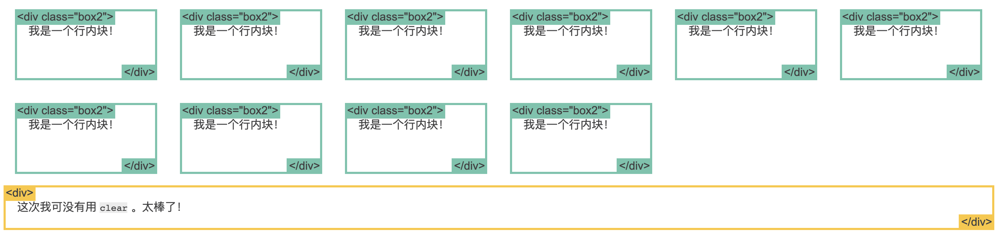

以及使用新的CSS属性column实现文字多列布局：

```css
.three-column {
  padding: 1em;
  -moz-column-count: 3;
  -moz-column-gap: 1em;
  -webkit-column-count: 3;
  -webkit-column-gap: 1em;
  column-count: 3;
  column-gap: 1em;
}
```

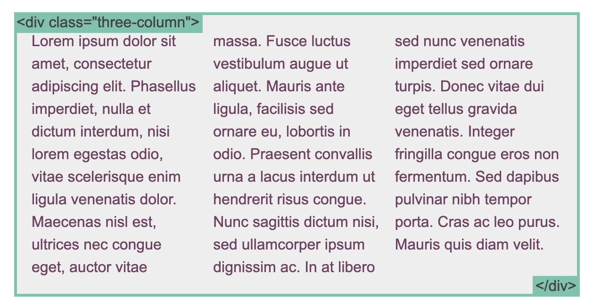

# 四. 弹性框布局

flex布局可以很轻松的实现以往需要各种复杂技巧才能实现的页面布局。开启flex布局的方式很简单，直接将元素的display属性设置为flex即可，此时其子元素的float，clear和vertical-align会失效。对块级元素可以设置flex，对行内元素同样可以使用inline-flex。下面先讲解基本概念和各种属性，然后我们通过实战来展示一下flex布局的强大。

## 4.1 基本概念

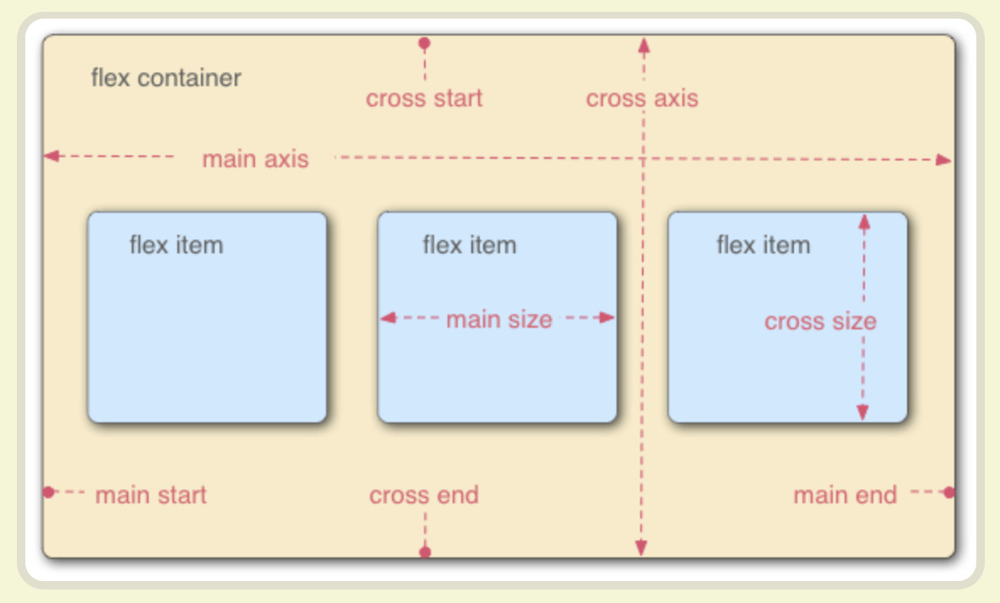

采用flex布局的元素称为flex容器（以下简称容器），它为容器的直接子元素提供了"弹性上下文"（注意display属性是不可继承的）。容器中所有的子元素被称为flex项（item，以下简称项）。容器中有两个轴：主轴（main）和交叉轴（cross）。主轴的开始位置（与边框的交叉点）叫做main start，结束位置叫做main end；交叉轴的开始位置叫做cross start，结束位置叫做cross end。项默认沿主轴排列。单个项占据的主轴空间叫做main size，占据的交叉轴空间叫做cross size。

## 4.2 容器属性

### 4.2.1 flex-direction

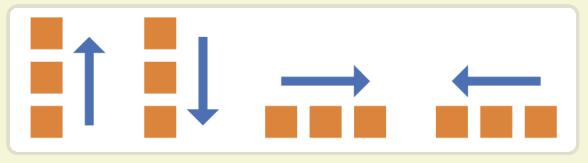

flex布局是一种单向的一维布局方法。flex-direction属性决定main轴的方向，它有4个值：

1. row：水平方向，起点左端
2. row-reverse：水平方向，起点右端
3. column：垂直方向，起点上端
4. Column-reverse：垂直方向，起点下端

### 4.2.2 flex-wrap


flex-wrap属性决定轴线排不下如何换行，nowrap表示不换行：

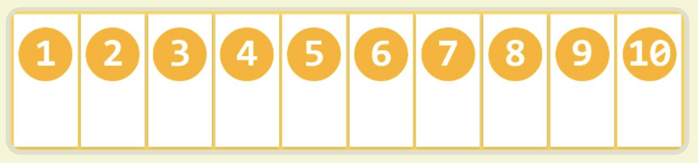

wrap表示换行，第一行在上方：

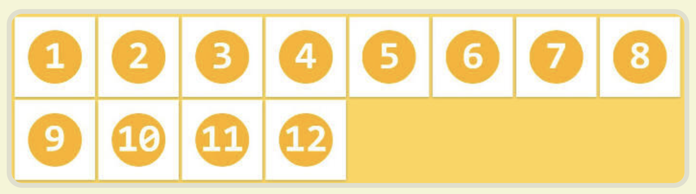

wrap-reverse表示换行，第一行在下方：

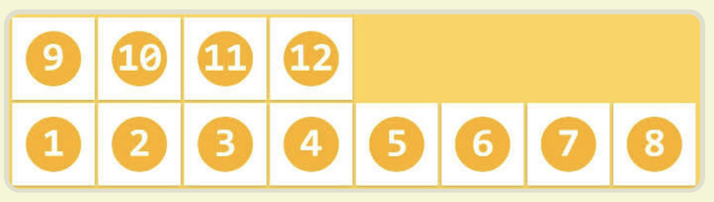

### 4.2.3 flex-flow

flex-flow属性是是flex-direction和flex-wrap的简写，默认值为row nowrap。

### 4.2.4 justify-content

justify-content属性决定项在主轴的对齐方式，有五个值：

1. flex-start：左对齐（默认）
2. flex-end：右对齐
3. center：居中
4. space-between：两端对齐，项之间间隔相等
5. space-around：每个项两侧的间隔相等，所以项之间的间隔比项与边框的间隔大一倍
6. space-evenly：每个项以及项和边缘之间的间隔均匀分布

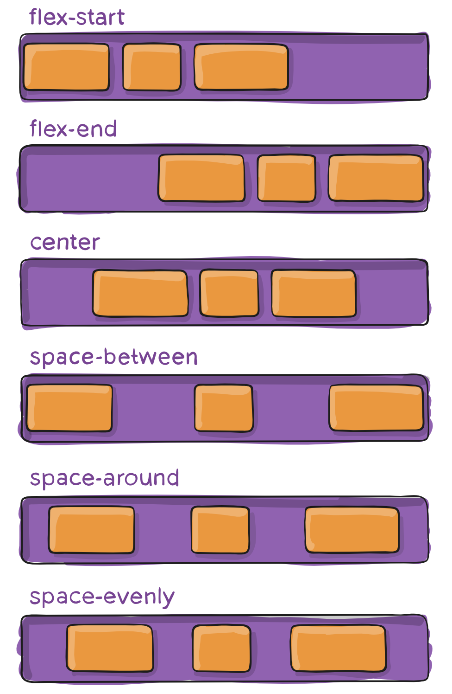


### 4.2.5 align-items


align-items属性决定项在交叉轴如何对齐，有如下五个值：

1. flex-start：交叉轴的起点对齐。

2. flex-end：交叉轴的终点对齐。

3. center：交叉轴的中点对齐。

4. baseline: 项目的第一行文字的基线对齐。

5. stretch（默认值）：如果项目未设置高度或设为auto，将占满整个容器的高度。

### 4.2.6 align-content


align-content属性决定多根轴线的对齐方式，如果项只有一根轴线，该属性不起作用。

1. flex-start：与交叉轴的起点对齐。

2. flex-end：与交叉轴的终点对齐。

3. center：与交叉轴的中点对齐。

4. space-between：与交叉轴两端对齐，轴线之间的间隔平均分布。

5. space-around：每根轴线两侧的间隔都相等。所以，轴线之间的间隔比轴线与边框的间隔大一倍。

6. stretch（默认值）：轴线占满整个交叉轴。

## 4.3 项属性

### 4.3.1 order


order属性定义项的排列顺序，数值越小排列越靠前，默认为0。

### 4.3.2 flex-grow


flex-grow属性定义项的放大比例，默认为0，即便存在剩余空间也不放大。如果所有项目的flex-grow属性都为1，则它们将等分剩余空间（如果有的话）。如果一个项目的flex-grow属性为2，其他项目都为1，则前者占据的剩余空间将比其他项多一倍。

### 4.3.3 flex-shrink


flex-shrink属性定义了项的缩小比例，默认为1，即如果空间不足，该项将缩小。如果所有项目的flex-shrink属性都为1，当空间不足时，都将等比例缩小。如果一个项目的flex-shrink属性为0，其他项目都为1，则空间不足时，前者不缩小，负值对该属性无效。

###4.3.4 flex-basis

flex-basis属性定义了在分配多余空间之前，项占据的主轴空间（main size）。浏览器根据这个属性，计算主轴是否有多余空间。它的默认值为auto，即项的本来大小。它可以设为跟width或height属性一样的值（比如350px，20%和5em等），则项将占据固定空间。

### 4.3.5 flex

flex属性是flex-grow, flex-shrink 和 flex-basis的简写，默认值为0 1 auto。后两个属性可选。该属性有两个快捷值：auto (1 1 auto) 和 none (0 0 auto)。建议优先使用这个属性，而不是单独写三个分离的属性，因为浏览器会推算相关值。

### 4.3.6 align-self


align-self属性允许单个项有与其他项不一样的对齐方式，可覆盖align-items属性。默认值为auto，表示继承父元素的align-items属性，如果没有父元素，则等同于stretch。该属性可能取6个值，除了auto，其他都与align-items属性完全一致。

## 4.4 布局实战

flex布局能够实现各种常见的布局，比如圣杯布局，输入框布局，媒体对象布局和固定的底栏。下面我们来看看这几种布局如何用flex布局实现。

### 4.4.1 圣杯布局


圣杯布局是一种很常见的布局，它分为三部分：header，body和footer，其中body又包含left，center和right三个部分。html代码如下：

```html
<body class="HolyGrail">
  <header>...</header>
  <div class="HolyGrail-body">
    <main class="HolyGrail-content">...</main>
    <nav class="HolyGrail-nav">...</nav>
    <aside class="HolyGrail-ads">...</aside>
  </div>
  <footer>...</footer>
</body>
```

css代码如下：

```css
.HolyGrail {
  display: flex;
  min-height: 100vh;
  flex-direction: column;
}

header,
footer {
  flex: 1;
}

.HolyGrail-body {
  display: flex;
  flex: 1;
}

.HolyGrail-content {
  flex: 1;
}

.HolyGrail-nav, .HolyGrail-ads {
  /* 两个边栏的宽度设为12em */
  flex: 0 0 12em;
}

.HolyGrail-nav {
  /* 导航放到最左边 */
  order: -1;
}
```

如果屏幕尺寸比较小，则变为三栏垂直叠加：

```css
@media (max-width: 768px) {
  .HolyGrail-body {
    flex-direction: column;
    flex: 1;
  }
  .HolyGrail-nav,
  .HolyGrail-ads,
  .HolyGrail-content {
    flex: auto;
  }
}
```

### 4.4.2 输入框布局


主要是实现输入框前方添加提示，后方添加按钮，html代码如下：

```html
<div class="InputAddOn">
  <span class="InputAddOn-item">...</span>
  <input class="InputAddOn-field">
  <button class="InputAddOn-item">...</button>
</div>
```

css代码如下：

```css
.InputAddOn {
  display: flex;
}

.InputAddOn-field {
  flex: 1;
}
```

### 4.4.3 媒体对象布局


有时候需要在文字的左边或者右边增加一个图片栏，而且要避免文字对图片的环绕。用flex的方式实现要比其他方式简洁，html代码如下：

```html
<div class="Media">
  
  <p class="Media-body">...</p>
</div>
```

css代码如下：

```css
.Media {
  display: flex;
  align-items: flex-start;
}

.Media-figure {
  margin-right: 1em;
}

.Media-body {
  flex: 1;
}
```

###4.4.4 固定的底栏


有时，页面内容太少，无法占满一屏的高度，底栏就会抬高到页面的中间。需要让底栏总是出现在页面的底部。html代码如下：

```html
<body class="Site">
  <header>...</header>
  <main class="Site-content">...</main>
  <footer>...</footer>
</body>
```

css代码如下：

```css
.Site {
  display: flex;
  min-height: 100vh;
  flex-direction: column;
}

.Site-content {
  flex: 1;
}
```


## 4.5 布局模式

一种响应式设计的技巧是"从小处开始"：准备多套设计稿，先从最小屏幕开始设计，然后更大一点的，逐步加大。从最小屏幕开始设计，可以对页面内容优先级进行排序，在设计的时候就考虑需要对用户展示哪些重要信息，不容易漏掉重要的信息，这对优化性能也有帮助，最后，把针对多种屏幕尺寸的设计使用媒体查询联系起来即可。flex布局和响应式设计相结合，有4种常见的布局模式：掉落列（column drop），大体流动（mostly fluid），活动布局（layout shifter）和画布溢出（off canvas）。

### 4.5.1 掉落列模型

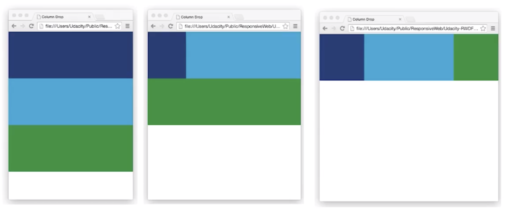

掉落队列模型在视口最窄的时候每个元素纵向堆放，第一个断点处，前两个元素并排显示，第三个元素在下面。第二个断点处，重排成三列布局。当视口达到最大宽度，列也达到最大宽度，在两侧添加外边距。html代码如下：

```html
<div class="container">
  <div class="box dark_blue"></div>
  <div class="box light_blue"></div>
  <div class="box green"></div>
</div>
```

基础css代码如下：

```css
.container {
  display: flex;
  flex-wrap: wrap;
}
.box {
  width: 100%;
}


```

第一个断点位于450px视口宽度：

```css
@media screen and (min-width: 450px) {
  .dark_blue {
    width: 25%;
  }
  .light_blue {
    width: 75%;
  }
}
```

第二个断点位于550px视口宽度：

```css
@media screen and (min-width: 550px) {
  .dark_blue, .green {
    width: 25%;
  }
  .light_blue {
    width: 50%;
  }
}
```

### 4.5.2 大体流动模型

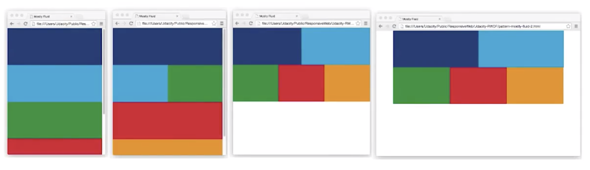

大体流动模型在视口最窄时仍然为竖直堆放布局。随着视口变宽，网格模型开始出现，当视窗达到最大宽度，两边出现外边距，内容不再延展。html代码如下：

```html
<div class="container">
  <div class="box dark_blue"></div>
  <div class="box light_blue"></div>
  <div class="box green"></div>
  <div class="box red"></div>
  <div class="box orange"></div>
</div>
```

基础css代码如下：

```css
.container {
  display: flex;
  flex-wrap: wrap;
}
.box {
  width: 100%;
}
```

第一个断点处的css代码：

```css
@media screen and (min-width: 450px) {
  .light_blue, .green {
    width: 50%;
  }
}
```

第二个断点处的css代码：

```css
@media screen and (min-width: 550px) {
  .dark_blue, .light_blue {
    width: 25%;
  }
  .green, .red, .orange {
    width: 33.333333%;
  }
}
```

当视口宽度大于700px时，增加外边距：

```css
@media screen and (min-width: 700px) {
  .container {
    width: 700px;
    margin-left: auto;
    margin-right: auto;
  }
}
```

### 4.5.3 活动布局模型


活动布局模型是最灵活的响应式模型，有很多适用于不同设备的断点。它的亮点在于利用了order属性重排元素顺序，每个布局可变化的地方比较多。html代码如下：

```html
<div class="container">
  <div class="box dark_blue"></div>
  <div class="container" id="container2">
    <div class="box light_blue"></div>
    <div class="box green"></div>
  </div>
  <div class="box red"></div>
</div>
```

基本的css代码如下：

```css
.container {
  width: 100%;
  display: flex;
  flex-wrap: wrap;
}
.box {
  width: 100%;
}
```

第一个断点设置在500px视口宽度：

```css
@media screen and (min-width: 500px) {
  .dark_blue {
    width: 50%;
  }
  #container2 {
    width: 50%;
  }
}
```

第二个断点设置在600px视口宽度：

```css
@media screen and (min-width: 600px) {
  .dark_blue {
    width: 25%;
    order: 1;
  }
  #container2 {
    width: 50%;
  }
  .red {
    width: 25%;
    order: -1;
  }
}
```

### 4.5.4 画布溢出模型

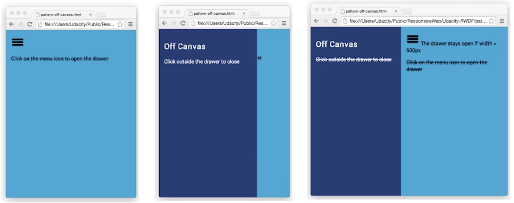

画布溢出模型是最复杂的。它的内容并不是竖直堆放的，诸如导航栏和应用菜单这样不常用内容需要放在屏幕之外，只有屏幕足够大的时候才显示出来。小尺寸屏幕上溢出画布的内容通常会在用户点击菜单按钮时出现。html代码如下：

```html
<nav id="drawer" class="dark_blue"></nav>
<main class="light_blue"></main>
```

基本的css代码如下：

```css
html, body, main {
  height: 100%;
  width: 100%; 
}

nav {
  width: 300px;
  height: 100%;
  position: absolute;
  /* 该变换将抽屉移出画布. */
  transform: translate(-300px, 0);
  /* 我们还可以为抽屉添加动画。 */
  transition: transform 0.3s ease;
}

nav.open {
  transform: translate(0, 0);
}
```

断点只有一个，在600px视口处显示侧边的导航栏：

```css
@media screen and (min-width: 600px) {
  nav {
    position: relative;
    transform: translate(0, 0);
  }
  
  body {
    display: flex;
    flex-flow: row nowrap;
  }
  
  main {
    width: auto;
    flex-grow: 1;
  }
}
```

这个布局需要使用一点点js代码来实现动态效果：

```css
var menu = document.querySelector('#menu');
var main = document.querySelector('main');
var drawer = document.querySelector('#drawer');

menu.addEventListener('click', function(e) {
  drawer.classList.toggle('open');
  e.stopPropagation();
});

main.addEventListener('click', function() {
  drawer.classList.remove('open');
});
```

以上就是flex布局的基本内容，我们需要在实践中多用多实践，熟练掌握这种强大的布局技术。flex布局适合小规模的布局，而更加强大的网格布局则适合大规模布局。

# 五. 网格布局

CSS的网格布局是一种二维的，基于网格的前端布局技术，完全改变了设计用户界面的方式。从布局发展的过程来看，从一开始基于tables，到float，再到positioning和inline-block，这些方法中充斥着大量的奇技淫巧，但连最基本的居中定位都做的不好。flex布局是一种很强大的基于轴线布局的一维布局方式，而网格布局则真正做到了基于行列单元格的二维布局，实际上flex搭配grid能工作的很好。网格布局与media query相结合同样也能通过寥寥数行代码实现响应式设计。

网格布局将网页划分为不同的网格，通过组合不同网格做出各种各样的布局。以前通过复杂css框架达成的效果现在浏览器内置了，所以称它为2019年必学的新布局方法，但目前浏览器的支持还存在一定问题，但以后会越来越好。

## 5.1 基本概念

同样地，在网格布局中只要给html元素增加了相应的display属性，该元素就变成**网格容器**：

```css
.container {
  display: grid | inline-grid
}
```

而容器的直接子元素被称为**项**（item），注意是直接子元素，因为display属性不可继承。网格布局还有一些专门的术语：行和列，网格线，网格轨道（track）和网格区域，下面来一一介绍。

### 5.1.1 行和列

在网格布局中，水平区域称之为**行**，垂直区域称之为**列**。**单元格**是行和列的交叉区域。


### 5.1.2 网格线

网格布局中的重要概念，分为水平网格线和垂直网格线，用于根据网格线定位位置。


### 5.1.3 网格轨道（grid track）

网格轨道是两相邻网格线之间的区域。

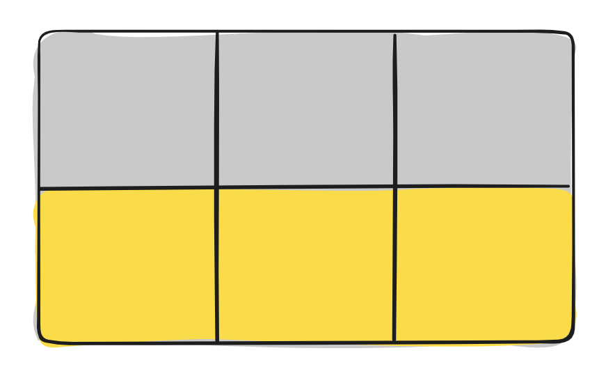

### 5.1.4 网格区域

网格区域是4条网格线之间包围的区域，由1个或多个单元格构成。

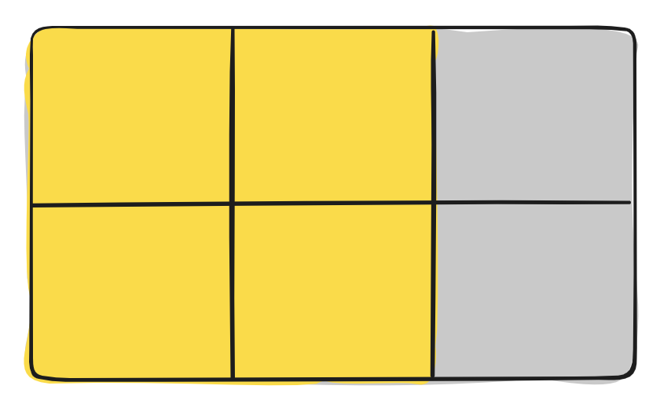

## 5.2 容器属性

## 5.3 项属性


响应式设计中的表格和字体

响应式设计中的图片

# 参考文献

[在移动浏览器中使用viewport元标签控制布局](<https://developer.mozilla.org/zh-CN/docs/Mobile/Viewport_meta_tag>)

[响应式网页设计](<http://www.ruanyifeng.com/blog/2012/05/responsive_web_design.html>)

[Udacity前端工程师纳米学位](<https://cn.udacity.com/fend>)

[Flex布局教程：语法篇](<http://www.ruanyifeng.com/blog/2015/07/flex-grammar.html>)

[Flex布局教程：实例篇](<http://www.ruanyifeng.com/blog/2015/07/flex-examples.html>)

[A Complete Guide to Flexbox](<https://css-tricks.com/snippets/css/a-guide-to-flexbox/>)

交互式css布局教程：[学习CSS布局](<http://zh.learnlayout.com/>)

交互式flex布局教程：[Learn Flexbox for free](<https://scrimba.com/g/gflexbox>)

[CSS Grid 网格布局教程](<http://www.ruanyifeng.com/blog/2019/03/grid-layout-tutorial.html>)

[A Complete Guide to Grid](<https://css-tricks.com/snippets/css/complete-guide-grid/>)


