# 现代JavaScript语言

这篇文章主要介绍如何编写面向对象的JavaScript。我们先从现代JavaScript语言的基本概念开始介绍，然后讲解this关键字。在有了这两个基础之后，我们将正式认识JavaScript语言中的面向对象编程：封装，继承和多态。这篇文章的第二部分将介绍ES6语法，其本质是语法糖，抹上一层语法糖会使得你的JS看起来更甜，这一部分也会介绍箭头函数，也就是其他编程语言中大名鼎鼎的Lambda表达式，但不会过多的涉及函数式编程的概念。最后，介绍异步的JavaScript，比如怎样使用JS向服务端发送异步请求，然后获得并处理结果。看完这篇文章后，你将对JavaScript这门编程语言有成体系化的理解。对于以后理解和掌握基于JS的其他语言，比如TypeScript都会很有帮助。

就让我们开始新的旅程吧！

# 一. 面向对象的JavaScript

基础概念部分将介绍几个重要的基本概念：作用域，执行上下文，闭包和this关键字。通过掌握作用域的知识，我们能够把握程序中什么变量在什么位置范围是有效的，而离开了那个范围之后就会失效。之后跟着一小段程序示例，我们一步一步推导执行上下文是怎么在内存中为变量建立内存模型的，弄清楚这两个概念就能够对编程有更深入的理解。最后，会介绍闭包(closure)这个稍微有点难理解的概念。搞懂这些概念对于学习任何编程语言都是有帮助的，你可以轻而易举地将在JS这里学到的知识迁移到其他任何编程语言中。this关键字是JS中另一个比较复杂的概念，也是用的不好容易出bug的地方，但只要我们在理解的过程中注意把握一个关键概念，很多看似纷繁复杂的东西就能迎刃而解。

在上述基本概念的基础上，我们将从封装，继承和多态入手，学习在JavaScript中进行面向对象编程的各种模式和技巧。乍一看很复杂，没有别的编程语言那么直观，但是不要担心，后面会有甜甜的语法糖来帮你减轻知识负担。

## 1.1 基础概念

### 1.1.1 作用域

JS中第一个重要的概念是作用域。在程序中可以通过变量名访问一个变量而不产生错误的区域，叫做这个变量的词法作用域。初始的作用域被称为全局作用域，任何在函数外面定义的变量，都具备全局作用域：

```javascript
var hero = aHero();
```

全局作用域是在多个js文件中共享的，也就是说在这个文件中访问另一个文件中定义的全局变量是完全合法的。在全局作用域的基础上，每次我们新定义一个函数，在这个花括号包围的函数体中就会创造出一个新的词法作用域。在这个词法作用域中定义的变量的生命周期就比全局作用域中的要小得多。这里要注意：1. 函数体中可以访问全局变量；2. 函数体可以访问在函数中定义的变量，但离开了函数体就不能被访问了；4. 如果所定义的变量a和全局作用域中的变量b重名，那么变量a就会覆盖掉变量b，直到离开函数所在的词法作用域。

在ES6语法出现之前，定义变量的最佳实践是使用var关键字，缺少var关键字变量会变成全局作用域：

```javascript
var hero = aHero();
var newSaga = function() {
  foil = afoil();
}
log(foil); // OK
```

这容易产生问题，因为此时foil自动变成全局变量，具有全局作用域，这将对阅读代码的人造成很大的困惑，所以在任何时候都要避免这样做。**一定要注意**，只有函数定义会创建新的词法作用域，条件和循环语句则不会，比如下面这段代码，在条件判断语句中定义的变量具有的是全局作用域，这是与其他编程语言不同的地方，要注意：

```javascript
var hero = aHero();
if (checkSomething()) {
  var foil = afoil();
}
log(foil); // OK
```

词法作用域是**静态**的概念，不用运行程序凭肉眼就能判断。一旦程序开始执行，解释器就会在内存中构建自己的存储系统存放变量名和对应的值，专业一点的说法叫**内存模型**。内存模型会形成自己的作用域，称为**执行上下文（execution context）**。不同于词法作用域，执行上下文是一边运行一边动态构建的，以下面这段代码为例，一步一步跟踪看看执行过程中解释器是怎么建立起执行上下文的：

```javascript
var hero = aHero();
var newSaga = function() {
  var foil = afoil();
  var saga = function() {
    var deed = aDeed();
    log(hero+deed+foil);
  };
  saga();
  saga();
}
newSaga();
newSaga();
```

在执行第一行代码之前，解释器会在内存中创建一个全局的执行上下文，对应全局作用域，因此都用浅绿色的区块来表示，如下图：

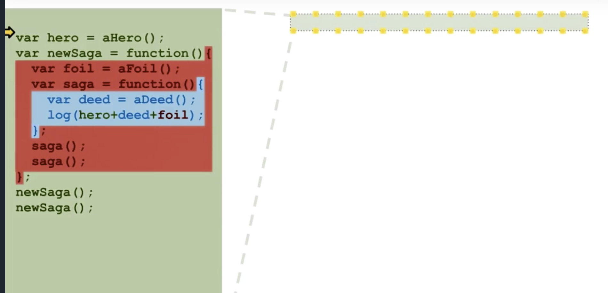

代码的前两行是变量定义，因此对应的执行上下文中会创建两个变量，hero变量指向字符串，newSaga变量指向一个函数定义，因为这里只是定义而没有执行，所以执行上下文会暂时忽略函数内部，而不会建立新的执行上下文，要记住，函数只有在执行的时候才会建立执行上下文。

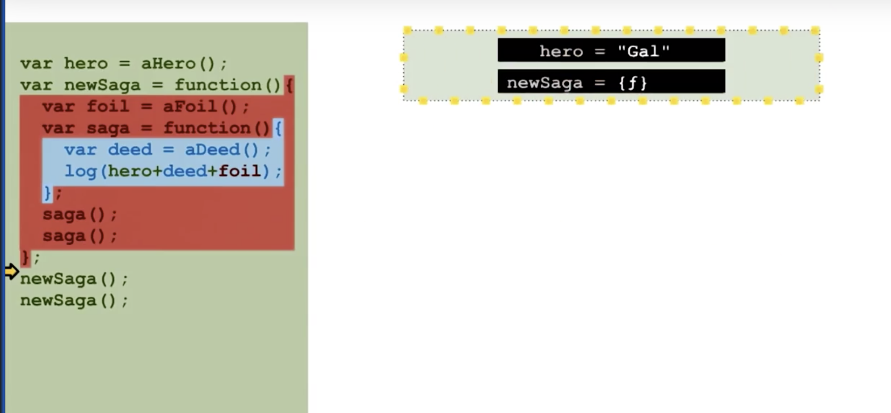
​			

当代码执行到第一个`newSaga()`时开始执行函数调用，此时内存中将为这个函数创建一个新的执行上下文，如下图中红色区块所示。我们来看一下当一行一行执行红色部分代码时，新的执行上下文是怎么一步一步创建起来的。

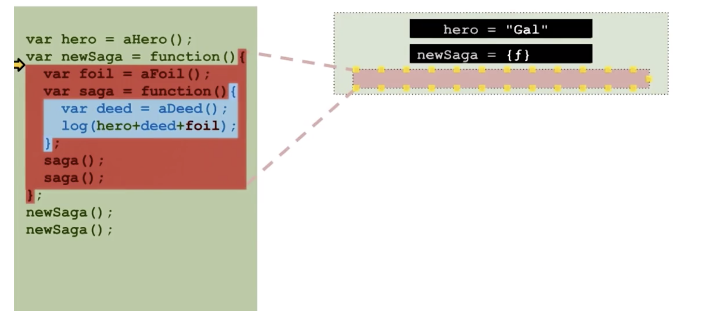

当执行函数中的代码时，变量的定义会在内存中建立起一一映射的模型，我们在`newSaga()`函数中定义了两个变量`foil`和`saga`，其中saga存储的是另一个新的函数定义。因此这里也将暂时忽略而不会在内存中创建新的执行上下文。

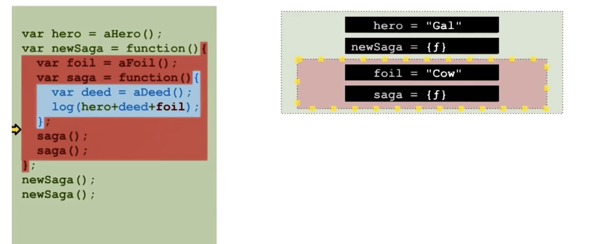

接着，开始执行`newSaga()`函数中的`saga()`函数，此时内存中新建了蓝色部分的新的执行上下文。定义变量`deed`时会在蓝色区块中建立相应的变量映射。

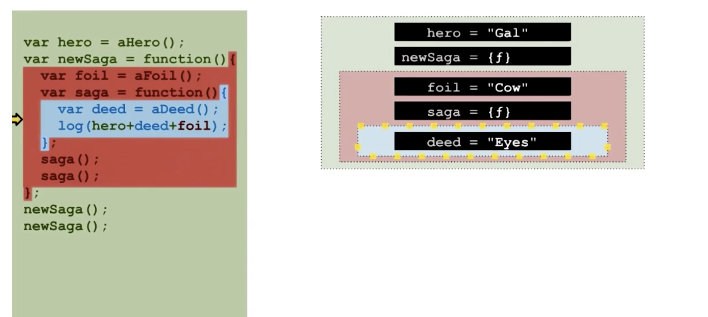

代码执行到`log(hero+deed+foil)`时，会由内向外查找变量的定义。先从蓝色的执行上下文中查找，发现找不到`hero`变量，于是向上一层，在红色部分查找，还是没有找到。最后再向上一层，在绿色部分找到了变量`hero`的定义。

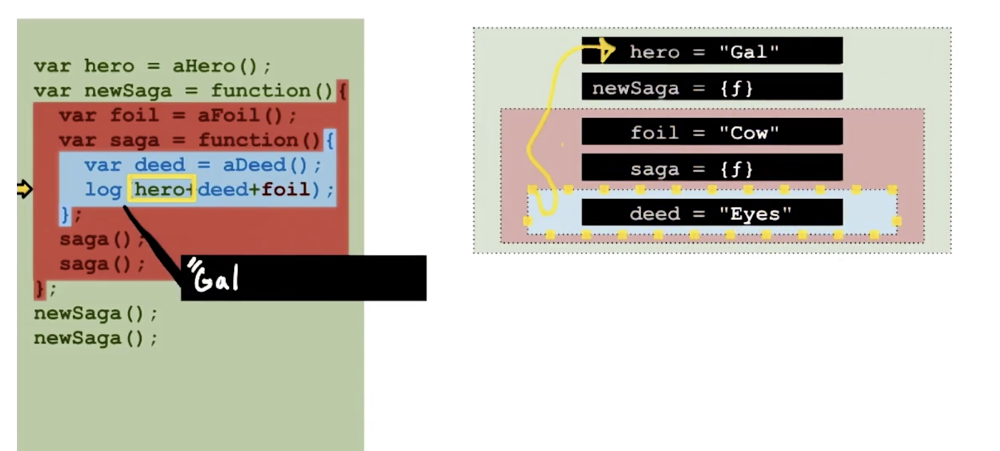

查找变量`deed`要容易一些，因为它的定义就在当前的执行上下文中，所以直接就能定位到了：

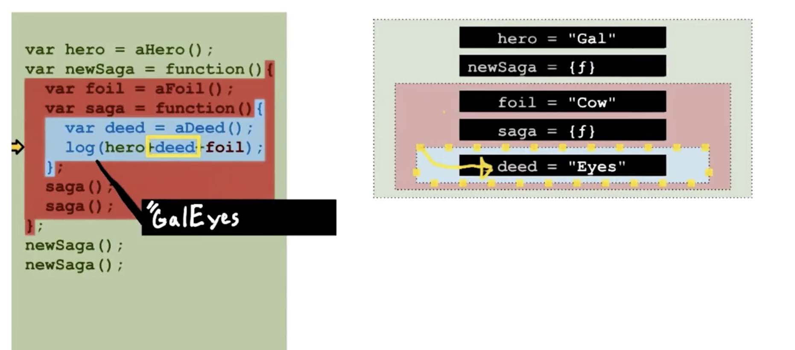

查找变量`foil`，需要向上一层在红色的执行上下文中找到：

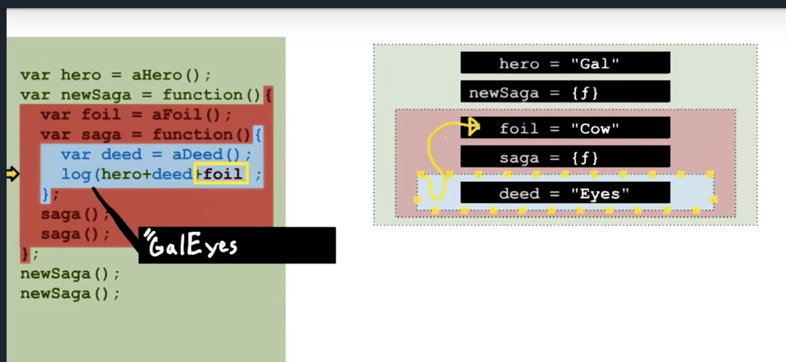

`log()`函数输出结果为"GalEyesCow"，第一个`saga()`函数调用执行完毕。

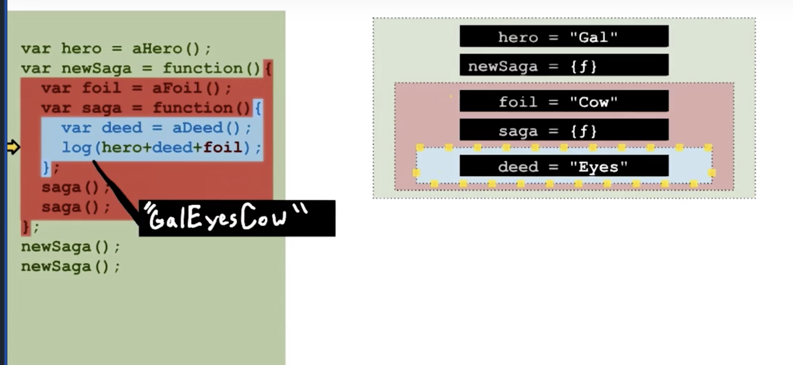

完成上面这些步骤，可能你还是没看出来词法作用域和执行上下文有什么区别。对比左右两张图，好像差不多都一样的，但是一旦开始执行第二个`saga()`函数调用，你就知道执行上下文不同于词法作用域的地方了。

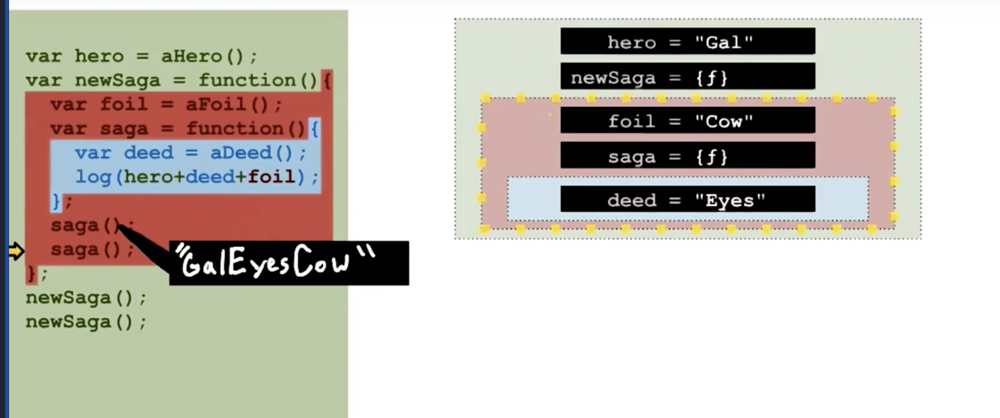

执行第二个`saga()`函数时，它会动态的创建新的执行上下文，与新的函数调用相对应。新的蓝色区块对应着第二次函数调用，它创建了一个新的`deed`变量，在内存中对应的值为"Tips"。

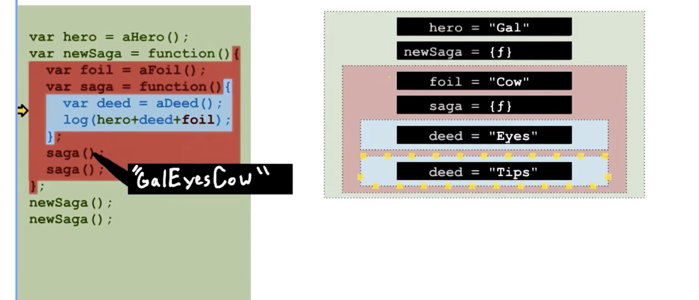

当再次执行到`log(hero+deed+foil)`函数调用时，仍然会重复上面的步骤，由内向外在不同的执行上下文中查找各变量的定义，并输出"GalTipsCow"。

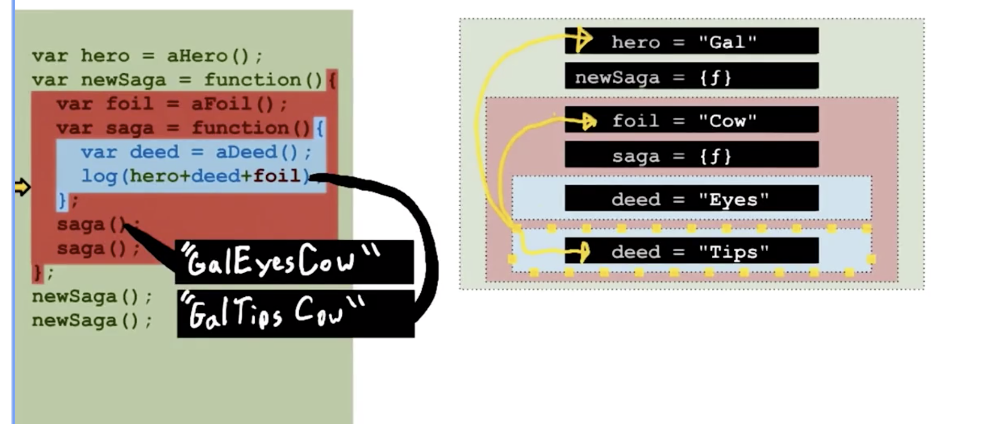

此时，第一个`newSaga()`函数算是执行完毕了，当我们再次执行第二个`newSaga()`函数时，就会重复上面的步骤，建立第二个红色+蓝色的执行上下文。

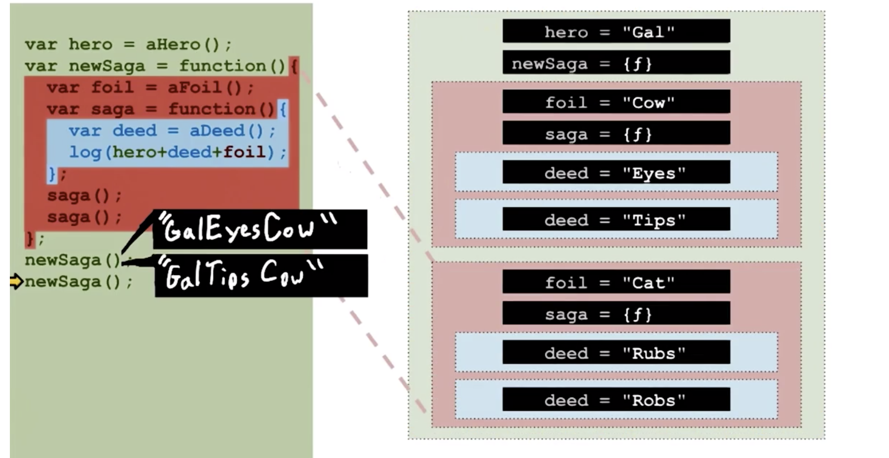

同样地，会输出"GalRubsCat"和"GalRobsCat"。注意这里的两个红色区块中都创建了诸如`foil`，`saga`和 `deed`等变量，但它们在内存中对应的值是不一样的。

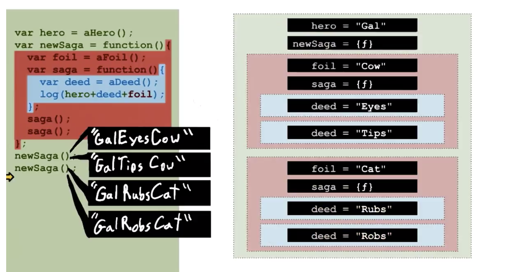

通过单步执行来观察执行上下文的创建过程，我们能深入理解程序是如何执行的，也更能深刻理解变量是怎么被定位到的，关键就是要记住**每执行一次函数就会创建一个新execution context**。

### 1.1.2 闭包

闭包(Closure)是一个与作用域有关的高级概念。简单地说，就是能访问到其外围作用域变量的函数，此时外围作用域已经执行结束了。这个概念看起来有些复杂，但如果我们使用上面的执行上下文来观察代码的执行过程，就能弄懂它的核心原理，这里先记住一句话：**新context永远被创建在定义它的函数context中**。示例代码如下：

```javascript
var sagas = [];
var hero = aHero();
var newSaga = function() {
  var foil = aFoil();
  sagas.push(function() {
    var deed = aDeed();
    log(hero+deed+foil);
  });
};
newSaga();
sagas[0]();
sagas[0]();
newSaga();
sagas[0]();
sagas[1]();
sagas[0]();
```

还是老办法，我们自己来模拟一遍解释器执行代码的顺序。首先，解释器会在内存中建立全局执行上下文：

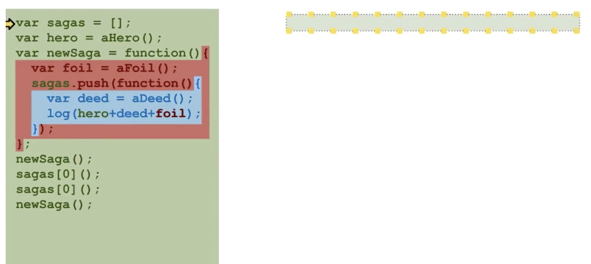

前两行定义变量，解释器会在内存中分别建立变量的映射关系。

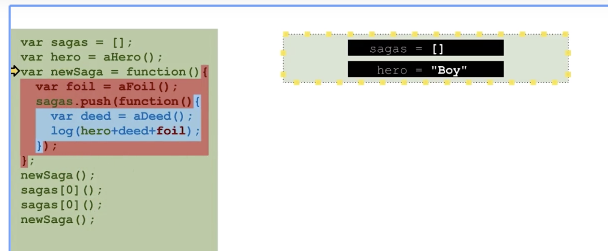

变量`newSaga`定义了一个函数体，在该函数体中定义了一个变量`foil`。然后向全局变量`sagas`数组中放入了一个函数对象。所以解释器会暂时忽略掉红色和蓝色部分，建立新的变量映射。

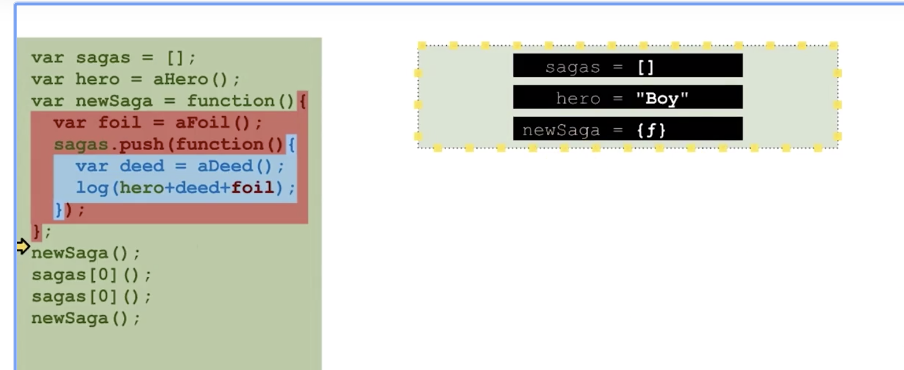

接下来正式调用`newSaga()`函数，函数在调用时会创建新的执行上下文，如下图中红色区块所示。

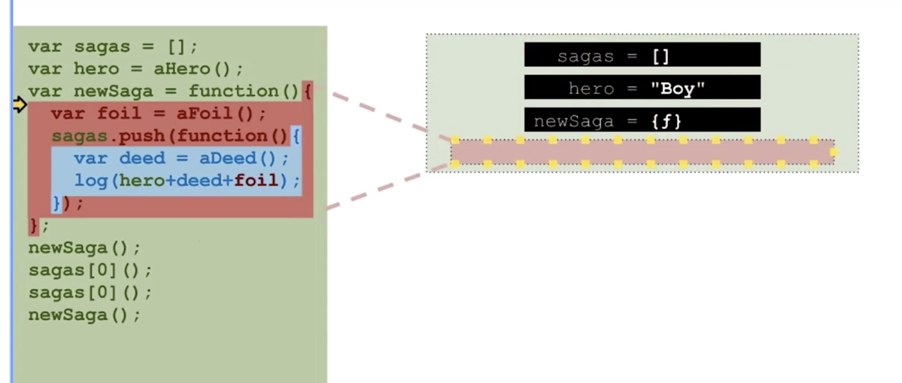

定义变量`foil`时，在红色区块的执行上下文中创建了变量映射。


接下来，将新创建的函数对象放入到sagas数组中，`newSaga()`函数执行结束。

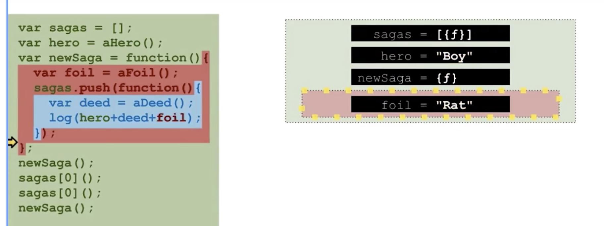

接下来，第一次执行函数对象`sagas[0]()`，创建蓝色区块表示的执行上下文。

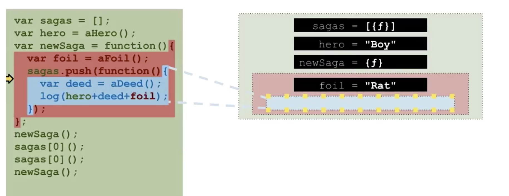

一旦我们定义变量`deed`，蓝色区块的执行上下文中就会建立对应的变量映射。

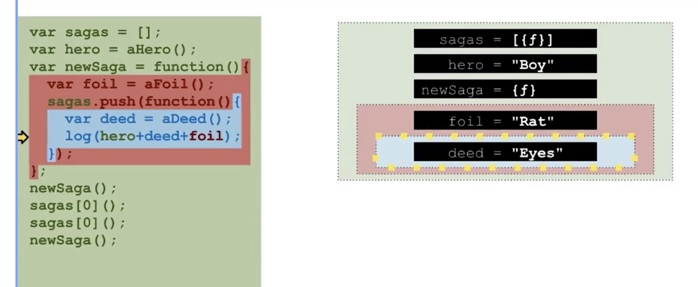

`log(hero+deed+foil)`函数会打印输出对应的值"BoyEyesRat"。

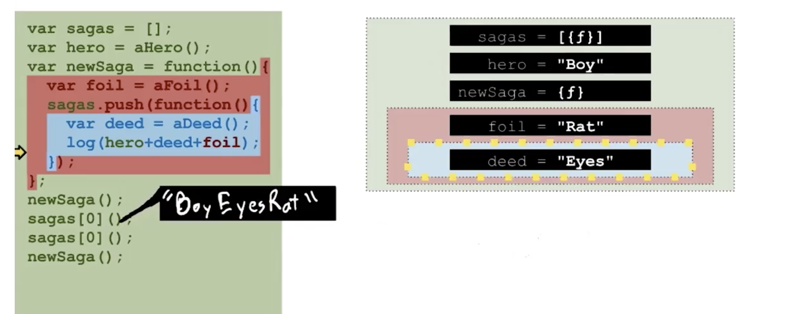​	

当第二次执行`sagas[0]()`函数时，将创建新的执行上下文，如下图中第二个蓝色区块所示。

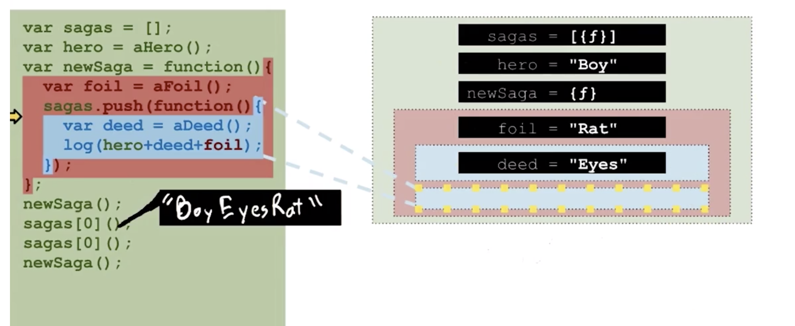

按照同样的函数执行流程，这里会建立新的`deed`变量的内存映射。然后打印输出"BoyDigsRat"。

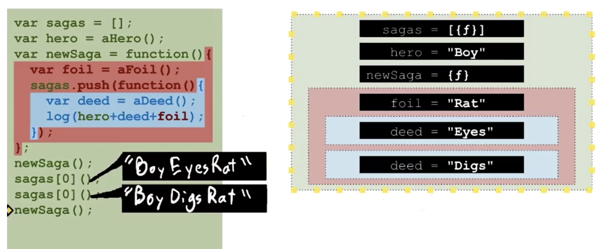

当我们第二次执行`newSaga()`函数时，会创建一个新的执行上下文，如下图中第二个红色区块所示。在这个红色区块中解释器建立了第二个`foil`变量的内存映射。	

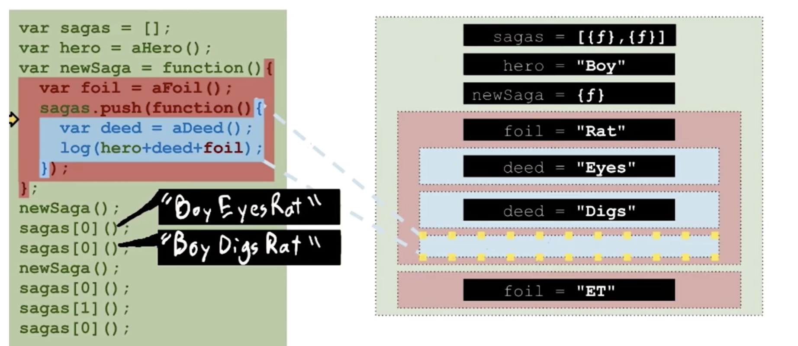

这个时候，如果我们再一次执行`sagas[0]()`函数会怎样？你觉得解释器会把它放到什么位置？其实和上面一样，解释器**一定会在原来定义它的执行上下文中创建新的执行上下文**，所以这里的函数调用仍然在第一个红色区块表示的执行上下文中创建了新的执行上下文，并将值为"Pins"的`deed`变量建立在里面，因为这个函数当初就是在这个执行上下文中被定义的，如下图所示。

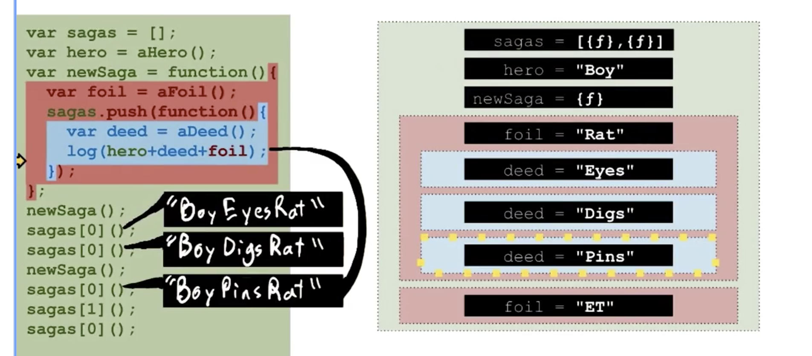

聪明的你肯定判断出来了，因为这里的`sagas[1]()`函数是在第二个红色区块表示的执行上下文中被创建的，因此这里的调用会在第二个红色执行上下文中创建新的执行上下文。

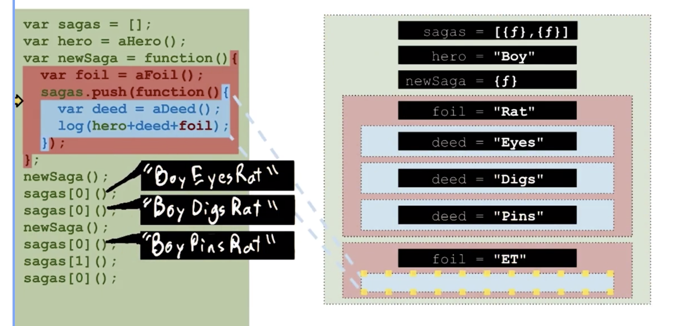

在新的蓝色执行上下文中，将创建新的变量`deed`，并得到值"Gets"，函数打印输出"BoyGetsET"。

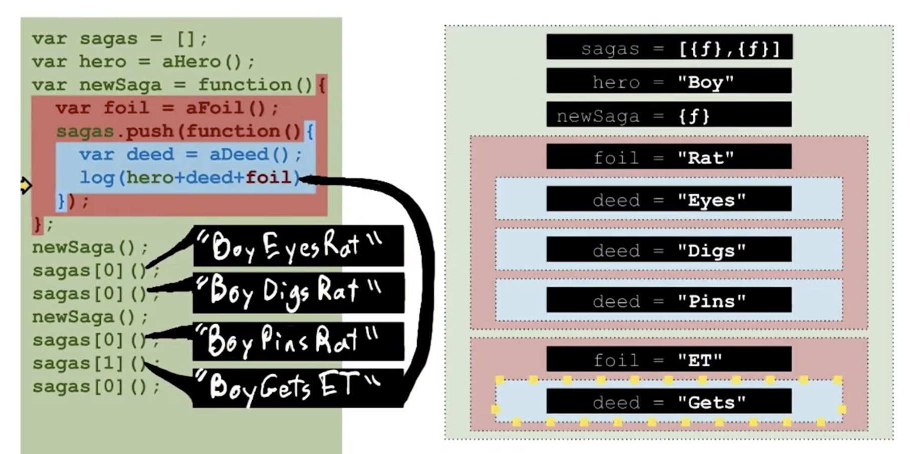

最后一步再次执行了`sagas[0]()`，这个函数的执行仍然会在第一个红色区块表示的执行上下文中创建新的执行上下文，并创建新的变量`deed`，这次它的值为"Eats"。

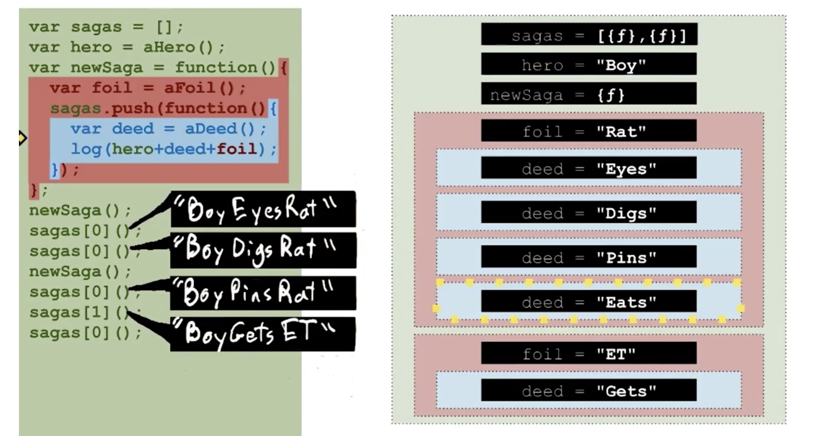

所以最后这一次函数调用，将打印输出"BoyEatsRat"。

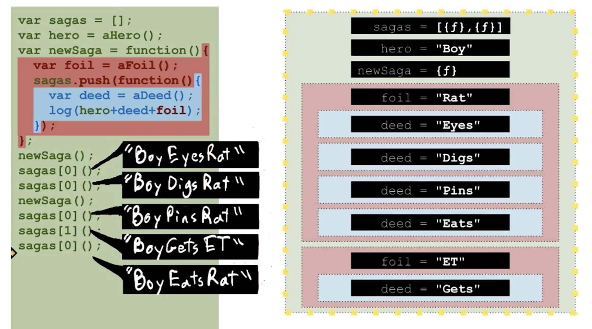

只要能把握**解释器会在原来定义它的执行上下文中创建新的执行上下文**这个核心，就能理解闭包这个概念。​

### 1.1.3this关键字


​			把握关键
​				调用时
​					直到调用的那一刻（位置）才确定
​			绑定规则
​				规则一
​					调用时的对象——"the left of dot" rule
​						the object found to the left of the dot where the containing function is called
​				规则二
​					直接调用
​						global
​						strict mode
​							undefined
​				规则三
​					fn.call(r, g, b)
​						this <-- r
​				规则四
​					作为callback
​						global
​				规则五
​					new r.method(g, b)
​						后台自动创建的新object
​				规则六
​					fn.bind()
​						创建新函数，this将永久地被绑定到了bind的第一个参数
​				规则七
​					箭头函数
​						根据当前上下文继承this
​	1.2 面向对象
​		把握关键
​			everything is an **OBJECT**
​			function is a special **OBJECT**
​		三大特性
​			封装
​				本质
​					bundling of data and their accessors
​				机制
​					原始方式
​						要创建多个对象怎么办？
​							通过函数
​								object decorator
​									为对象添加新属性
​									缺点
​										函数多次拷贝
​								functional class
​									自己创建对象
​									创建新对象的特殊函数被称为类
​									缺点
​										函数多次拷贝
​										解决方案
​											functional shared pattern
​												将函数定义移到外面去
​												Constructor.methods
​								constructor pattern
​									new运算符
​									解释器构造
​										this = Object.create(Class.prototype);
​										return this;
​								prototype pattern
​									constructor func.prototype
​								prototype class
​									组合
​										functional class
​										prototype pattern
​								pseudo class
​									constructor pattern
​									prototype pattern
​			继承
​				本质
​					effective code reuse
​				机制
​					prototype chain
​						Object.create(obj)
​							create an empty object whose .prototype === obj
​						对象之间建立“链”式关联
​							顶层对象
​								Object.prototype
​									提供所有对象共享属性和方法
​									constructor
​							数组原型
​								Array.prototype
​				实现
​					functional class
​						抽取公共代码
​					pseudo class
​						构造子类
​							继承属性
​								.call()
​									calls a function with a given **this**
​									相当于其他语言中的Super()
​							继承方法
​								原型委托
​									Sub.prototype = Object.create(Super.prototype);
​							恢复子类构造函数
​								.prototype.constructor
​									Sub.prototype.constructor = Sub;
​							定义自己特有的方法
​			多态
​				本质
​					same interface but different implementaions
​				机制
​					prototype lookup
​						链式向上查找
​						一旦找到即停止回溯
​						instanceof运算符

# 二. ECMAScript 6

​	ES6语法
​		声明变量
​			var
​				存在hoisting
​					全局作用域
​					函数作用域
​				不再使用
​			let/const
​				{}块作用域
​				let
​					可以再次赋值
​					不可再次声明
​				const
​					不可再次赋值
​					不可再次声明
​		模板字面量
​			举例
​				let greetings = `Hello, my name is ${name}`;
​			换行符也被当做字面量一部分
​			${}强大功能
​				运算
​				调用函数
​				使用循环
​		解构
​			其实就是模式匹配
​			数组
​				const [x, y, z] = point;
​					可选择性忽略
​			对象
​				const {type, color, karat} = gemstone;
​		对象字面量简写
​			同名变量不必重复写
​			function关键字可省略
​		迭代
​			for..of循环
​				iterable protocol
​					String
​					Array
​					Map
​					Set
​		...运算符
​			展开运算
​				将Array和Set展开成单个元素
​					拼接数组
​						[...fruits, ...vegetables]
​			剩余参数
​				将不定数量的元素表示为数组
​				可变参数函数
​	ES6函数
​		箭头函数表达式
​			简练主体语法
​			块体语法
​			this关键字
​				取决于这个函数在代码中的位置
​				从周围上下文继承了this值
​		默认参数函数
​			解构
​				数组
​					function createGrid([width = 5, height = 5] = [])
​				对象
​					function createSundae({scoops = 1, toppings = ['Hot Fudge']} = {})
​		类
​			语法糖
​				函数
​				原型继承
​			继承关系
​				extends
​				super
​					既可当函数
​					又可当对象
​	ES6内置功能
​		符号类型
​			唯一标识符
​			常用于
​				唯一标识对象属性
​		迭代协议
​			iterable
​				自定义迭代行为
​				用于for..of
​				[Symbol.iterator]
​					返回
​						iterator
​			iterator
​				实现了next()函数的对象
​					0参
​					返回一个对象
​						done
​						value
​		Set
​			创建
​				new Set()
​			修改
​				add()
​				delete()
​				clear()
​			检查
​				has()
​				size
​			迭代
​				for..of
​				values()
​					SetIterator
​			WeakSet
​				只能包含对象
​				无法迭代
​				没有clear()
​				垃圾回收时自动删除
​		Map
​			创建
​				new Map()
​			修改
​				set()
​				delete()
​				clear()
​			检查
​				has()
​			迭代
​				MapIterator
​					keys()
​					values()
​				for..of
​				forEach()
​			WeakMap
​				只能以对象为键
​				无法迭代
​				没有clear()方法
​				垃圾回收时自动删除
​		Promise
​			异步执行的任务
​				状态
​					pending
​						fulfilled
​						rejected
​			执行完成通知
​				成功
​					resolve()
​				失败
​					reject()
​				执行回调
​					then()
​		Proxy
​			一个对象代表另一个对象
​				处理另一个对象所有交互
​			创建
​				new Proxy(被代理的对象, 处理程序)
​			处理程序
​				由各种trap组成
​		生成器
​			可暂停的函数
​				yield
​					向外面发送
​					从外面接收
​			function*
​	ES6专业开发者
​		Polyfill
​			修补功能，为浏览器提供支持
​				SVG
​				Canvas
​				网络存储
​					本地存储
​					会话存储
​				视频
​				HTML5 元素
​				无障碍功能
​				Web Sockets
​		Babel
​			转译器（transpiler）

HTML Canvas
	基础
	从像素到动画
		requestAnimationFrame

# 三. 异步的JavaScript

​	Promise
​		用途
​			try..catch wrapper for
​				unpredictable task
​					asynchronous
​					deferred
​		状态
​			pending
​				settled ONCE
​					fulfilled
​					rejected
​		使用
​			wrapping
​				封装异步任务
​					主线程执行
​						阻塞
​				new Promise(func)
​					func
​						resolve param
​						reject param
​			thening
​				fulfilled
​					resolve()
​				回调
​					action
​			catching
​				rejected
​					reject()
​				回调
​					recovering
​			链式调用
​				promises
​					forEach
​					map
​				Promise.all()
​					全部执行成功才算成功
​	AJAX
​		用途
​			异步获取数据
​				XML
​				JSON
​				HTML
​			无需更新全部页面
​		通过XHR
​			请求
​				new XMLHttpRequest()
​				.open()
​				.onload
​				.onerror
​				.send()
​			响应
​				.responseText
​		通过jQuery
​			.ajax()
​			便利方法
​				get()
​				getJSON()
​				getScript()
​				post()
​				load()
​		通过fetch
​			基于Promise