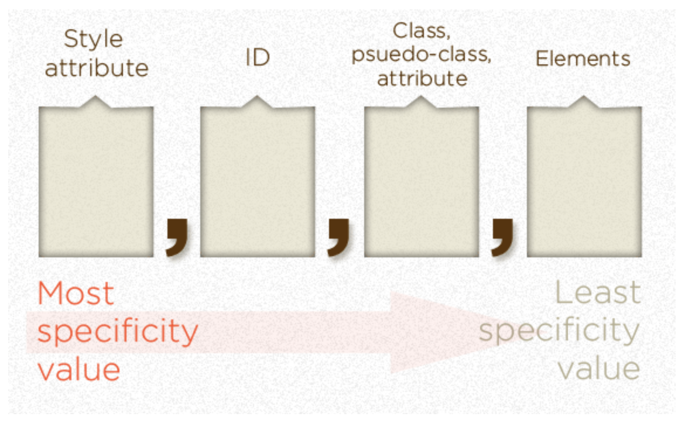

# CSS基础语法总结

CSS是Cascading Style Sheet的简称，用来负责对页面的内容进行样式渲染。是前端开发领域中第二重要的DSL，本文对CSS的以下知识要点进行总结：

1. 规则集
2. CSS中的单位
3. CSS中的颜色

## 一. 规则集

CSS是以规则集的形式被书写出来的。每个规则由两部分组成，一个是选择器（selector），一个是声明块（delcaration block）。一个常见的CSS规则如下所示：
```css
div {
    text-align: right;
}
```
这里的选择器为div，意味着匹配所有的div标签。声明块为`{ text-align: right; }`。声明块可以有多条语句构成，每行一个，以分号隔开。CSS中有复杂的选择器机制，下面我们来一一介绍。

### 1.1 ID选择器

ID选择器以#号开头，匹配的是HTML元素中对应ID的元素，例如我们有这样的ID选择器：
```css
#happy-cake {

}
```
那么：
```html
<!-- WILL match -->
<div id="happy-cake"></div>

<!-- WILL match -->
<aside id="happy-cake"></aside>

<!-- Will NOT match -->
<div id="sad-cake">Wrong ID!</div>

<!-- Will NOT match -->
<div class="happy-cake">That's not an ID!</div>
```

### 1.2 类选择器

类选择器则以句点`.`开头，匹配的是HTML元素中对应class的元素，它可以匹配多个相同class的HTML元素，比如以下的类选择器：
```css
.module {

}
```
那么：
```html
<!-- WILL match -->
<div class="module"></div>

<!-- WILL match -->
<aside class="country module iceland"></aside>

<!-- Will NOT match -->
<div class=".module">The dot is for CSS, not HTML</div>

<!-- Will NOT match -->
<div class="bigmodule">Wrong class</div>
```

### 1.3 标签选择器

标签选择器用于匹配HTML的元素。比如我们要选择所有的h2标签：

```css
h2 {

}
```
那么：
```html
<!-- WILL match -->
<h2>Hi, Mom</h2>

<main>
  <div>
     <!-- WILL match -->
     <h2>Anywhere</h2>
  </div>
</main>

<!-- Will NOT match -->
<div class="h2">Wrong tag, can't trick it</div>

<!-- Will NOT match -->
<h2class="yolo">Make sure that tag has a space after it!</h2>
```

### 1.4 属性选择器

属性选择器的基本用法是选择具有某个属性的元素。举例，如果我要匹配rel属性为external的h1元素，那么可以写：

```css
h1[rel="external"] {

}
```

属性选择器还有很多[高级用法](https://css-tricks.com/attribute-selectors/)。上面用到的=属于精确匹配，其他常用的还有：
1. *=模糊匹配：`h1[rel*="external"] { color: red; }`选择`<h1 rel="xxxexternalxxx">Attribute Contains</h1>`
2. ^=开头匹配：`h1[rel^="external"] { color: red; }`选择`<h1 rel="external-link yep">Attribute Begins</h1>`
3. $=结尾匹配：`h1[rel$="external"] { color: red; }`选择`<h1 rel="friend external">Attribute Ends</h1>`
4. ~=匹配空格分隔的多个属性：`h1[rel~="external"] { color: red; }`选择`<h1 rel="friend external sandwich">Attribute Space Separated</h1>`
5. |=匹配破折号-分隔的多个属性的第一个：`h1[rel|="friend"] { color: red; }`选择`<h1 rel="friend-external-sandwich">Attribute Dash Separated</h1>`
6. 多重属性选择：`h1[rel="handsome"][title^="Important"] { color: red; }`选择`<h1 rel="handsome" title="Important note">Multiple Attributes</h1>`

### 1.5 伪类选择器

伪类选择器用于指定元素的状态，以冒号`:`开头，比如`:hover`表示当鼠标悬停时在元素上应用样式。又比如`:nth-child`这样的位置选择器可以用复杂的语法进行子节点选择，一些常用的[例子](https://css-tricks.com/useful-nth-child-recipies/)可以实现复杂的选择。

### 1.6 关系选择器

CSS中还有一类选择器叫做关系选择器，它用来根据元素与元素之间的关系来选择元素并渲染样式。常见的有：

1. E: first-child表示任一是其父母节点的第一个子节点的元素E
2. B + E表示元素B的任一下一个兄弟元素E
3. B ~ E表示B元素后面的拥有共同父元素的兄弟元素E
4. A > E表示元素A的任一子元素E(也就是直系后代)
5. A E表示元素A的任一后代元素E (后代节点指A的子节点，子节点的子节点，以此类推)

### 1.7 任意组合

熟悉了上面的几种要点，在实际开发中我们就可以任意组合来编写各种复杂的规则集，举例：

```css
.module.news {  
  /* Selects elements with BOTH of those classes */
}
#site-footer::after {
  /* Adds content after an element with that ID */
}
section[data-open] {
  /* Selects only section elements if they have this attribute */
}
.module > h2 {
  /* Select h2 elements that are direct children of an element with that class */
} 
h2 + p {
  /* Select p elements that are directly following an h2 element */
}
li ~ li {
  /* Select li elements that are siblings (and following) another li element. */
}
```

以上就是规则集的[工作原理](https://css-tricks.com/how-css-selectors-work/)，选择器的详细说明，可以参考[官方文档](https://developer.mozilla.org/zh-CN/docs/Web/Guide/CSS/Getting_started/Selectors)。
				
### 1.8 CSS特异值

CSS选择器有基于特异值的优先级规则，一般来说，特异值相同的选择器，处在下方的会覆盖上方的规则。对于特异值不同的选择器，高特异值的选择器会优先于低特异值的选择器被使用。特异值的计算方法如下图所示：



元素的样式属性特异值最高，然后是ID，再然后是类和伪类以及属性选择器，最后是标签选择器，具体的计算方法可以参考[这篇文章](https://css-tricks.com/specifics-on-css-specificity/)。
			
二.	CSS中的长度单位

CSS中[表示长度的单位](https://developer.mozilla.org/zh-CN/docs/Web/CSS/length)分为两种。一种是相对长度，比如用于相对字体大小的有em，ex，ch，rem，lh和rlh。用于视口比例长度（视口是指文档可视部分）的有vh，vw，vi，vb，vmin和vmax，相对长度常用于响应式设计。绝对长度单位有px，mm，cm，in，pt和pc。
			
三.	CSS中的颜色

CSS中表示颜色有三种方式：RGB，HEX和字符串。RGB是用0-255的数值来分别表示Red，Green和Blue三种颜色配比，例如`rgb(255, 0, 255)`。HEX则用#号开头的16进制数来表示，比如上面的颜色也可以表示成`#FF00FF`，HEX表示法可以[简写](https://developer.mozilla.org/zh-CN/docs/Web/CSS/Shorthand_properties)。最后一种是字符串，比如blue，但这种方式无法表达一些不常见的颜色。[在线颜色选择器](https://www.webfx.com/web-design/hex-to-rgb/)对确认颜色很有帮助。

以上就是对CSS基本用法的一个总结，详细的CSS属性可以参考[官方索引](https://developer.mozilla.org/zh-CN/docs/Web/CSS/Reference)。
		
